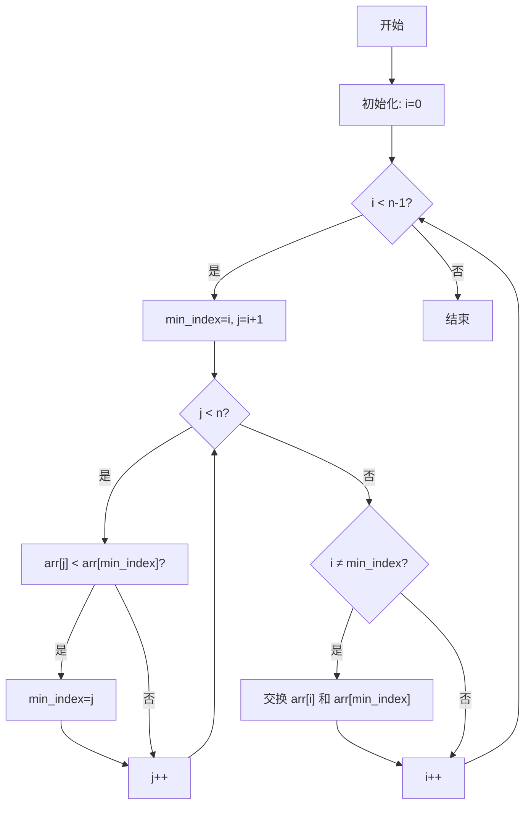
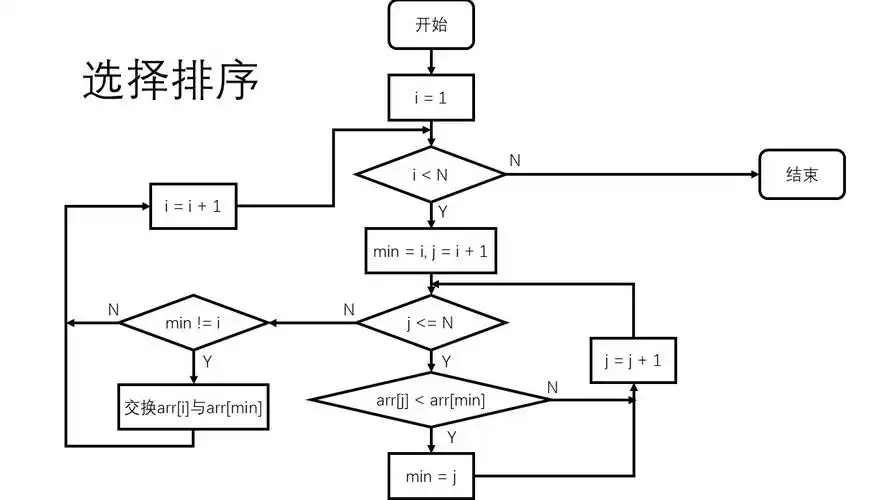

# 算法 - 选择排序

[[toc]]

> 说在前面的话，本文为个人学习[B站免费的左程云算法结构基础课](https://www.bilibili.com/video/BV1Ef4y1T7Qi/?spm_id_from=333.788.recommend_more_video.1&vd_source=65c7f6924d2d8ba5fa0d4c448818e08a)后进行总结的文章，主要是以`Java`来运行算法.

## 【1】定义

> - <b>选择排序（`Selection Sort`）</b>
>
> ::: info 定义
>
> <b>选择排序（`Selection Sort`）</b> 即 在随机数组中选择最小元素按照从小到大的顺序进行排序的过程。
>
> :::
>
> - <b>核心思想</b>
>   - 将数组分为‌**已排序区间**‌和‌**未排序区间**‌
>   - 每轮从未排序区间中选出‌**最小元素**‌
>   - 将该元素与未排序区间的‌**第一个元素**‌交换
>   - 重复上述过程直到数组完全有序

## 【2】算法流程图





## 【3】算法步骤说明

> - **初始化**‌
>    设置外层循环索引 `i=0`，表示当前待填充位置。
> - **遍历未排序序列**‌
>    内层循环从 `i+1` 到 `n-1`，寻找最小元素的索引 `min_index`。
>    `if arr[j] < arr[min_index]` 则更新 `min_index = j`。
> - ‌**交换元素**‌
>    若 `min_index ≠ i`，交换 `arr[i]` 和 `arr[min_index]`。
> - ‌**移动边界**‌
>    `i++` 后重复上述过程，直到 `i = n-2`（共执行 `n-1` 趟）。

### 【4】核心特性

> - ‌**时间复杂度**‌：固定为 `O(n²)`，无论数据是否有序。
> - ‌**空间复杂度**‌：`O(1)`（原地排序）。
> - ‌**不稳定性**‌：交换可能改变相等元素的原始顺序。

##  【5】代码示例

> ```java
> package com.learn.algorithm.business;
> 
> /**
>  * 选择排序算法
>  *
>  * @author qianpengzhan
>  * @since 2025/8/14 15:05
>  */
> public class SelectionSort {
>     public static void main(String[] args) {
> 
>     }
> 
>     // 选择排序 即  选择最小元素按照从小到大排序的算法过程
> 
>     public static void selectionSort(int[] arr) {
>         if (arr == null || arr.length < 2) {
>             // 数组为空 或者 元素数量 不足2个  排序无意义
>             return;
>         }
> 
>         // 第一轮: 1. 0 ~ N-1 进行遍历  2. (看+找)遍历的过程中每次都比较前后的数值 找出最小值  3.(换)替换当前值和最小值的下标
>         // 第二轮：1. 1 ~ N-1 进行遍历  2.同上 3.同上
>         // 第三轮: 1. 2 ~ N-1 进行遍历  2.同上 3.同上
>         // ...
>         // 第N轮:  1. N-1 ~ N-1 进行遍历  2.同上 3.同上
>         for (int i = 0; i < arr.length - 1; i++) {  // i ~ N-1
>             // 设定最小值下标
>             int minIndex = i;
>             for (int j = i + 1; j < arr.length; j++) {
>                 // 比较2数谁最小 找出最小的数的下标
>                 minIndex = arr[j] < arr[minIndex] ? j : minIndex;
>             }
>             // 替换当前值和最小值的下标
>             swap(arr, i, minIndex);
>         }
>     }
> 
>     /**
>      * 替换当前值和最小值的下标  即 交换2个数的位置
>      *
>      * @param arr       数组
>      * @param currIndex 当前值的下标
>      * @param minIndex  最小值的下表
>      */
>     public static void swap(int[] arr, int currIndex, int minIndex) {
>         int temp = arr[currIndex];
>         arr[currIndex] = arr[minIndex];
>         arr[minIndex] = temp;
>     }
> }
> 
> ```

## 【X】参考资料

- [B站免费的左程云算法结构基础课](https://www.bilibili.com/video/BV1Ef4y1T7Qi/?spm_id_from=333.788.recommend_more_video.1&vd_source=65c7f6924d2d8ba5fa0d4c448818e08a)