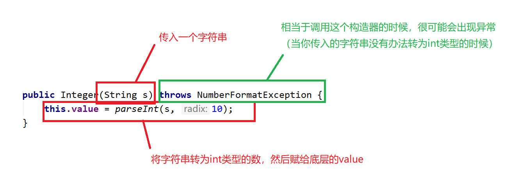
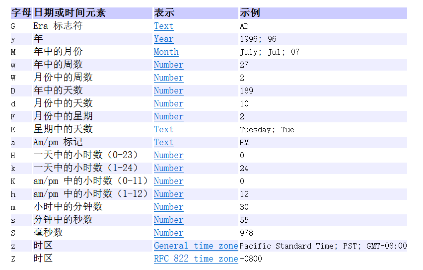
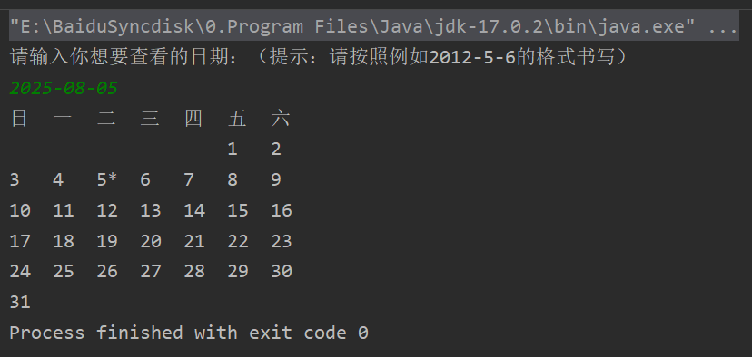
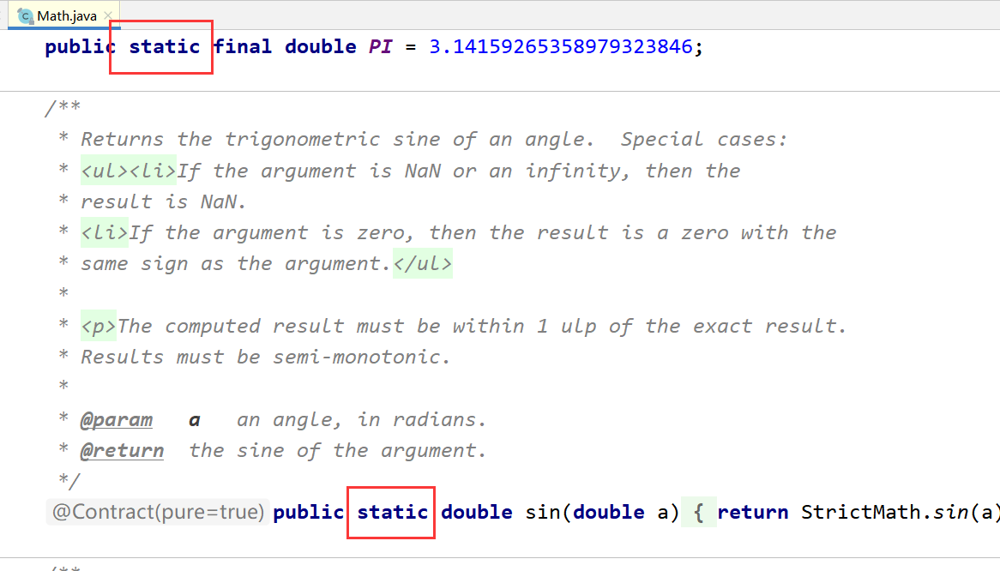
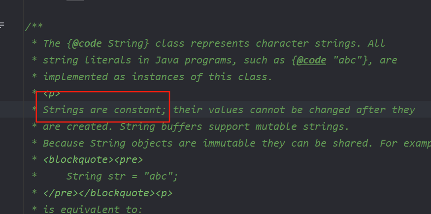
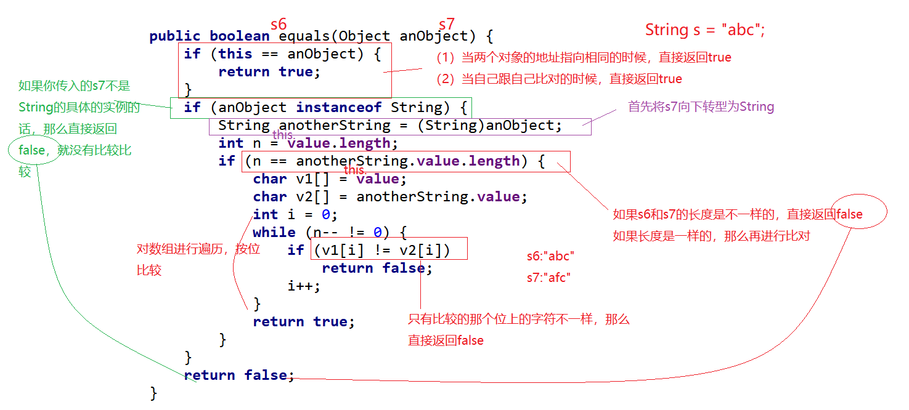
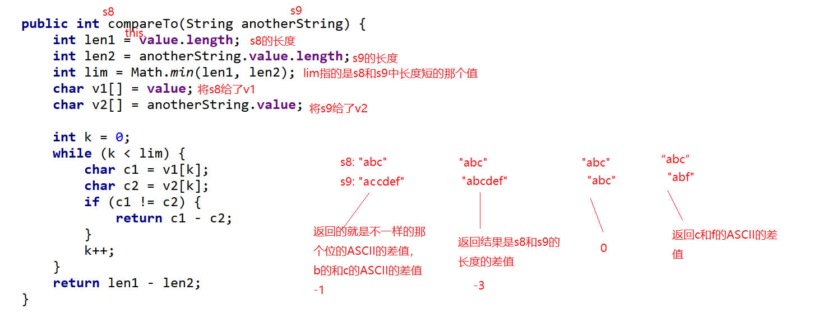
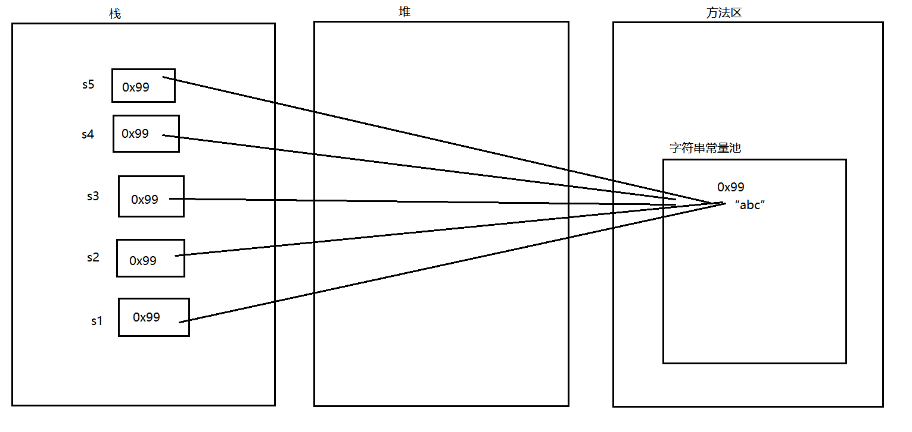
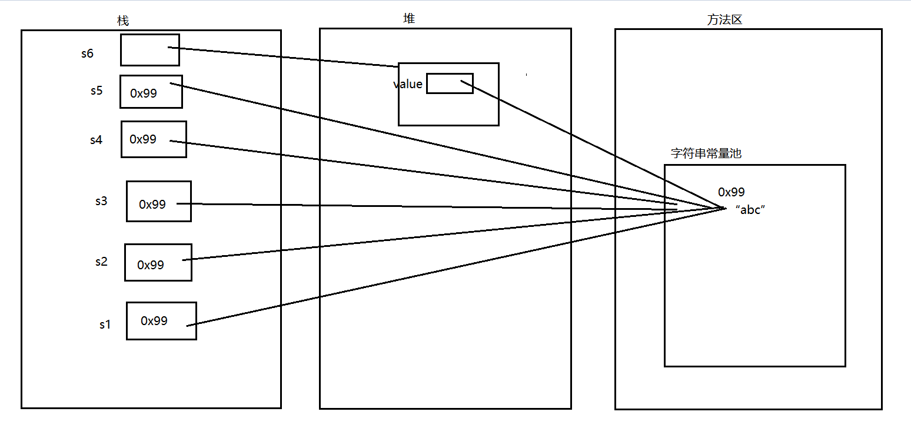
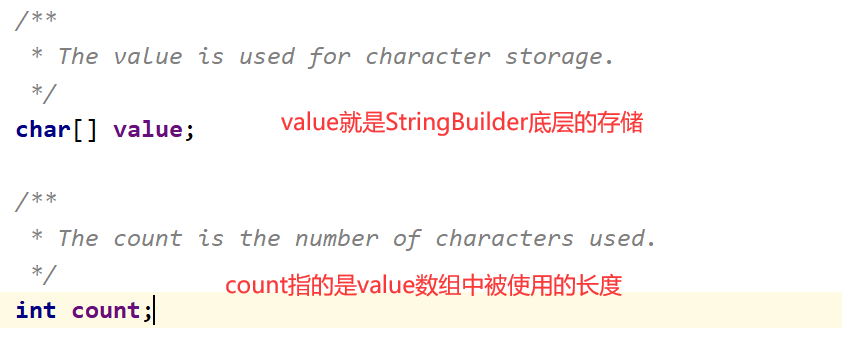

# JAVA基础知识 \- 常用类

[[toc]]

> 说在前面的话，本文为个人学习[B站免费的马士兵java初级教程](https://www.bilibili.com/video/BV1RK4y1g7A5/?spm_id_from=333.337.search-card.all.click&vd_source=65c7f6924d2d8ba5fa0d4c448818e08a)后进行总结的文章，本文主要用于<b>JAVA基础知识</b>。

## 【1】包装类

### 1.1 引入

> - 【1】什么是包装类？
>
>   - > ::: info <b>包装类</b>
>     >
>     > <b>包装类</b>：以前定义变量，经常使用基本数据类型，对于基本数据类型来说，它就是一个数，加点属性，加点方法，加点构造器，将基本数据类型对应进行了一个封装，产生了一个新的类 -- <b>包装类</b>
>     >
>     > :::
>
>     > `EG`：
>     >
>     > `int,byte`.....--->基本数据类型
>     > 包装类--->引用数据类型
>
> - 【2】对应关系
>
>   - 基本数据类型          对应的包装类                继承关系
>     - `byte`                          `Byte`                           --->`Number`--->`Object`
>     - `short`                         `Short`                         --->`Number`--->`Object`
>     - `int`                             `Integer`                      --->`Number`--->`Object`
>     - `long`                          `Long`                          --->`Number`--->`Object`
>     - `float`                          `Float`                          --->`Number`--->`Object`
>     - `double`                      `Double`                      --->`Number`--->`Object`
>     - `char`                          `Character`                  `Object`
>     - `boolean`                    `Boolean`                    `Object`
>
> - 【3】已经有基本数据类型了，为什么要封装为包装类？
>
>   - （1）`java`语言 面向对象的语言，最擅长的操作各种各样的类。
>   - （2）以前学习装数据的--->数组，`int[]`  `String[]`  `double[`]   Student[]
>   - （3）以后学习的装数据的--->集合，有一个特点，只能装引用数据类型的数据 
>
> - 【4】是不是有了包装类以后就不用基本数据类型了？
>
>   - > 不是。

### 1.2 `Integer` 

#### 1.2.1 使用

> 无需导入包，直接使用, 在 `java,lang`包下
>
> 

#### 1.2.2 类的继承关系

> 

#### 1.2.3 实现接口

> 

#### 1.2.4 被`final`修饰

> 这个类被`final`修饰，那么这个类<font style="color:red;"><b>不能有子类，不能被继承</b></font>
>
> 

#### 1.2.5 类的衍生

> 包装类是对基本数据类型的封装： 对`int`类型封装产生了`Integer`
>
> 

#### 1.2.6 类的历史

> 
>
> 从`JDK1.0` 就开始有包装类了

#### 1.2.7 属性

> 我们写一段测试代码， 如下，然后编译执行下:
>
> ```java
> package com.learn.javabasic.oftenuse;
> 
> /**
>  * @author qianpengzhan
>  * @since 2025/8/5 10:43
>  */
> public class IntegerTest {
>     public static void main(String[] args) {
>         //属性：
>         System.out.println(Integer.MAX_VALUE);
>         System.out.println(Integer.MIN_VALUE);
>         //“物极必反”原理：
>         System.out.println(Integer.MAX_VALUE + 1);
>         System.out.println(Integer.MIN_VALUE - 1);
>     }
> }
> 结果：
> 2147483647
> -2147483648
> -2147483648
> 2147483647
> ```
>
> 这里我们发现： ` Integer.MAX_VALUE + 1 =  -2147483648`  变成负数了.
>
> 这个就是超出了包装类的最大值后会出现的反值现象。

#### 1.2.8 构造器

> `Integer`的源码中是没有空参构造器的。
>
> - （1）int类型作为构造器的参数：
>
>   ```java
>   Integer i1 = new Integer(12);
>   ```
>
> 
>
> - （2）String类型作为构造器的参数：
>
> ```java
> Integer i2 = new Integer("12");
> Integer i3 = new Integer("abcdef");
> ```
>
> 
>
> ::: warning 注意
>
> ```java
> @Deprecated(since="9", forRemoval = true)
> public Integer(int value) {
>     this.value = value;
> }
> @Deprecated(since="9", forRemoval = true)
> public Integer(String s) throws NumberFormatException {
>     this.value = parseInt(s, 10);
> }
> ```
>
> `JDK9`之后就没有构造器，只能`Integer.valueOf()`
>
> :::

#### 1.2.9 自动拆装箱

> - 包装类特有的机制：自动装箱  自动拆箱
>
> ```java
> //自动装箱：int--->Integer
> Integer i = 12;
> System.out.println(i);
> //自动拆箱：Integer--->int
> Integer i2 = new Integer(12);
> int num = i2;
> System.out.println(num);
> ```
>
> - （1）自动装箱  自动拆箱 是从`JDK1.5`以后新出的特性
> - （2）自动装箱  自动拆箱 ：将基本数据类型和包装类进行快速的类型转换。
> - 验证：
>   - 
>   - 可以自定打断点测试是否走入valueOf方法中：
>   - 

#### 1.2.10 常用方法

> - `valueOf`方法的底层：
>
> 

> - `CompareTo()`
>
> 代码示例：
>
> ```java
> package com.learn.javabasic.oftenuse;
> 
> /**
>  * @author qianpengzhan
>  * @since 2025/8/5 10:43
>  */
> public class IntegerTest {
>     public static void main(String[] args) {
>         //属性：
>         System.out.println(Integer.MAX_VALUE);
>         System.out.println(Integer.MIN_VALUE);
>         //“物极必反”原理：
>         System.out.println(Integer.MAX_VALUE + 1);
>         System.out.println(Integer.MIN_VALUE - 1);
> 
> 
>         //compareTo：只返回三个值：要么是0,-1,1
>         Integer i1 = Integer.valueOf(6);
>         Integer i2 = Integer.valueOf(12);
>         System.out.println(i1.compareTo(i2));// return (x < y) ? -1 : ((x == y) ? 0 : 1);
>         //equals:Integer对Object中的equals方法进行了重写，比较的是底层封装的那个value的值。
>         //Integer对象是通过new关键字创建的对象：
>         Integer i3 = Integer.valueOf(12);
>         Integer i4 = Integer.valueOf(12);
>         System.out.println(i3 == i4);//false 因为==比较的是两个对象的地址
>         boolean flag = i3.equals(i4);
>         System.out.println(flag);
>         //Integer对象通过自动装箱来完成：
>         Integer i5 = 130;
>         Integer i6 = 130;
>         System.out.println(i5.equals(i6));//true
>         System.out.println(i5 == i6);
>         /*
>         如果自动装箱值在-128~127之间，那么比较的就是具体的数值
>         否在，比较的就是对象的地址
>          */
>         //intValue() :作用将Integer--->int
>         Integer i7 = 130;
>         int i = i7.intValue();
>         System.out.println(i);
>         //parseInt(String s) :String--->int:
>         int i8 = Integer.parseInt("12");
>         System.out.println(i8);
>         //toString:Integer--->String
>         Integer i10 = 130;
>         System.out.println(i10.toString());
>     }
> }
> ```
>
> > 结果：
> >
> > Tue Aug 05 13:13:11 CST 2025
> > Tue Aug 05 13:13:11 CST 2025
> > 5 Aug 2025 05:13:11 GMT
> > 2025年8月5日 下午1:13:11
> > 125
> > 7
> > 1754370791594
> > 1754370791641

## 【2】日期相关类

### 2.1 `java.util.Date`类

> - 代码示例
>
> ```java
> package com.learn.javabasic.oftenuse;
> 
> import java.util.Date;
> 
> /**
>  * @author qianpengzhan
>  * @since 2025/8/5 11:37
>  */
> public class DateTimeTest {
>     public static void main(String[] args) {
>         // 1.最早的日期类 Java.util.Date
>         Date d = new Date();
>         System.out.println(d);// 打印d对象  Tue Aug 05 13:13:11 CST 2025
>         System.out.println(d.toString()); // toString 打印  Tue Aug 05 13:13:11 CST 2025
>         System.out.println(d.toGMTString());//过期方法，过时方法，废弃方法。  5 Aug 2025 05:13:11 GMT
>         System.out.println(d.toLocaleString());    //2025年8月5日 下午1:13:11
>         System.out.println(d.getYear());//125+1900=2025
>         System.out.println(d.getMonth());//7 (8月):返回的值在 0 和 11 之间，值 0 表示 1 月。
>         //返回自 1970 年 1 月 1 日 00:00:00 GMT 以来此 Date 对象表示的毫秒数。
>         System.out.println(d.getTime());//1754370791594
>         System.out.println(System.currentTimeMillis()); //1754370791641
>         /*
>         （1）疑问：以后获取时间差用：getTime()还是currentTimeMillis()
>         答案：currentTimeMillis()-->因为这个方法是静态的，可以类名.方法名直接调用
>         （2）public static native long currentTimeMillis();
>         本地方法
>         为什么没有方法体？因为这个方法的具体实现不是通过java写的。
>         （3）这个方法的作用：
>         一般会去衡量一些算法所用的时间
>          */
> //        long startTime = System.currentTimeMillis();
> //        for (int i = 0; i < 100000; i++) {
> //            System.out.println(i);
> //        }
> //        long endTime = System.currentTimeMillis();
> //        System.out.println(endTime - startTime);
>     }
> }
> ```

### 2.2 `java.sql.Date`类

> - (1) `java.sql.Date`是`java.util.Date`的子类
>   - 
> - (2)   `Date`的实例含义不同
>   - `java.util.Date`：年月日  时分秒
>   - `java.sql.Date`：年月日
> - (3)  `java.util.Date` 转 `java.sql.Date`
>   - 1. 向下转型
>     2. 利用构造器

> ```java
> package com.learn.javabasic.oftenuse;
> 
> import java.sql.Date;
> 
> /**
>  * @author qianpengzhan
>  * @since 2025/8/5 13:36
>  */
> public class SqlDateTest {
>     public static void main(String[] args) {
>         //java.sql.Date:
>         Date d = new Date(1592055964263L);
>         System.out.println(d);
>         /*
>         (1)java.sql.Date和java.util.Date的区别：
>         java.util.Date：年月日  时分秒
>         java.sql.Date：年月日
>         (2)java.sql.Date和java.util.Date的联系：
>         java.sql.Date(子类) extends java.util.Date （父类）
>          */
>         //java.sql.Date和java.util.Date相互转换：
>         //【1】util--->sql:
>         java.util.Date date = new Date(1592055964263L);//创建util.Date的对象
>         //方式1：向下转型
>         Date date1 = (Date) date;
>         /*
>         父类：Animal 子类：Dog
>         Animal an = new Dog();
>         Dog d = (Dog)an;
>          */
>         //方式2：利用构造器
>         Date date2 = new Date(date.getTime());
>         //【2】sql-->util:
>         java.util.Date date3 = d;
>         //[3]String--->sql.Date:
>         Date date4 = Date.valueOf("2019-3-8");
>     }
> }
> 
> ```

### 2.3 `java.text.SimpleDateFormat`类

> 因为日期的实例化或者转换对格式要求是固定的，当我们想按照我们日常的格式去处理的经常会报错：
>
> 
>
> 正因为这种局限性，我们引申出1个新的类  `java.text.SimpleDateFormat`

```java
package com.learn.javabasic.oftenuse;

import java.text.DateFormat;
import java.text.ParseException;
import java.text.SimpleDateFormat;
import java.util.Date;

/**
 * @author qianpengzhan
 * @since 2025/8/5 14:00
 */
public class SimpleDateFormatTest {
    public static void main(String[] args) {
        //日期转换：
        //SimpleDateFormat(子类) extends DateFormat（父类是一个抽象类）
        //格式化的标准已经定义好了：
        DateFormat df = new SimpleDateFormat("yyyy-MM-dd HH:mm:ss");
        //String--->Date
        try {
            Date d = df.parse("2025-08-05 12:23:54");
            System.out.println(d);// Tue Aug 05 12:23:54 CST 2025
        } catch (ParseException e) {
            e.printStackTrace();
        }
        //Date--->String
        String format = df.format(new Date());
        System.out.println(format);//2025-08-05 14:01:45
        Date date = new Date();
        System.out.println(date.toString());   // Tue Aug 05 14:01:45 CST 2025
        System.out.println(date.toGMTString()); // 5 Aug 2025 06:01:45 GMT
        System.out.println(date.toLocaleString()); //2025年8月5日 下午2:01:45
    }
    /**
     * Tue Aug 05 12:23:54 CST 2025
     * 2025-08-05 14:01:45
     * Tue Aug 05 14:01:45 CST 2025
     * 5 Aug 2025 06:01:45 GMT
     * 2025年8月5日 下午2:01:45
     */
}

```

> `SimpleDateFormat`主要就是为了日常日期时间的格式化。
>
> 通用的日常格式如下:
>
> 

### 2.4 `java.util.Calendar`

> 代码示例：
>
> ```java
> package com.learn.javabasic.oftenuse;
> 
> import java.util.Calendar;
> import java.util.GregorianCalendar;
> 
> /**
>  * @author qianpengzhan
>  * @since 2025/8/5 14:12
>  */
> public class CalendarTest {
>     public static void main(String[] args) {
>         //Calendar是一个抽象类，不可以直接创建对象
>         //GregorianCalendar()子类 extends Calendar（父类是一个抽象类）
>         Calendar cal = new GregorianCalendar();
>         Calendar cal2 = Calendar.getInstance();
>         System.out.println(cal);
>         //常用的方法：
>         // get方法，传入参数：Calendar中定义的常量
>         System.out.println(cal.get(Calendar.YEAR));
>         System.out.println(cal.get(Calendar.MONTH));
>         System.out.println(cal.get(Calendar.DATE));
>         System.out.println(cal.get(Calendar.DAY_OF_WEEK));
>         System.out.println(cal.getActualMaximum(Calendar.DATE));//获取当月日期的最大天数
>         System.out.println(cal.getActualMinimum(Calendar.DATE));//获取当月日期的最小天数
>         // set方法：可以改变Calendar中的内容
>         cal.set(Calendar.YEAR, 1990);
>         cal.set(Calendar.MONTH, 3);
>         cal.set(Calendar.DATE, 16);
>         System.out.println(cal);
>         //String--->Calendar:
>         //分解：
>         //String--->java.sql.Date:
>         java.sql.Date date = java.sql.Date.valueOf("2020-4-5");
>         //java.sql.Date-->Calendar:
>         cal.setTime(date);
>         System.out.println(cal);
>     }
> }
> 
> /**
>  * 2025
>  * 7
>  * 5
>  * 3
>  * 31
>  * 1
>  * java.util.GregorianCalendar[time=?,areFieldsSet=false,areAllFieldsSet=true,lenient=true,zone=sun.util.calendar.ZoneInfo[id="Asia/Shanghai",offset=28800000,dstSavings=0,useDaylight=false,transitions=31,lastRule=null],firstDayOfWeek=1,minimalDaysInFirstWeek=1,ERA=1,YEAR=1990,MONTH=3,WEEK_OF_YEAR=32,WEEK_OF_MONTH=2,DAY_OF_MONTH=16,DAY_OF_YEAR=217,DAY_OF_WEEK=3,DAY_OF_WEEK_IN_MONTH=1,AM_PM=1,HOUR=2,HOUR_OF_DAY=14,MINUTE=12,SECOND=37,MILLISECOND=513,ZONE_OFFSET=28800000,DST_OFFSET=0]
>  * java.util.GregorianCalendar[time=1586016000000,areFieldsSet=true,areAllFieldsSet=true,lenient=true,zone=sun.util.calendar.ZoneInfo[id="Asia/Shanghai",offset=28800000,dstSavings=0,useDaylight=false,transitions=31,lastRule=null],firstDayOfWeek=1,minimalDaysInFirstWeek=1,ERA=1,YEAR=2020,MONTH=3,WEEK_OF_YEAR=15,WEEK_OF_MONTH=2,DAY_OF_MONTH=5,DAY_OF_YEAR=96,DAY_OF_WEEK=1,DAY_OF_WEEK_IN_MONTH=1,AM_PM=0,HOUR=0,HOUR_OF_DAY=0,MINUTE=0,SECOND=0,MILLISECOND=0,ZONE_OFFSET=28800000,DST_OFFSET=0]
>  */
> ```

### 2.5 日期练习

> 
>
> ```java
> package com.learn.javabasic.oftenuse;
> 
> import java.util.Calendar;
> import java.util.Scanner;
> 
> /**
>  * @author qianpengzhan
>  * @since 2025/8/5 14:32
>  */
> public class DateExe {
>     public static void main(String[] args) {
>         //录入日期的String：
>         Scanner sc = new Scanner(System.in);
>         System.out.print("请输入你想要查看的日期：（提示：请按照例如2012-5-6的格式书写）");
>         String strDate = sc.next();
>         /*System.out.println(strDate);*/
>         //String--->Calendar:
>         //String-->Date:
>         java.sql.Date date = java.sql.Date.valueOf(strDate);
>         //Date--->Calendar:
>         Calendar cal = Calendar.getInstance();
>         cal.setTime(date);
>         //后续操作：
>         //星期提示：
>         System.out.println("日\t一\t二\t三\t四\t五\t六\t");
>         //获取本月的最大天数：
>         int maxDay = cal.getActualMaximum(Calendar.DATE);
>         //获取当前日期中的日：
>         int nowDay = cal.get(Calendar.DATE);
>         //将日期调为本月的1号：
>         cal.set(Calendar.DATE, 1);
>         //获取这个一号是本周的第几天：
>         int num = cal.get(Calendar.DAY_OF_WEEK);
>         /*System.out.println(num);*/
>         //前面空出来的天数为：
>         int day = num - 1;
>         //引入一个计数器：
>         int count = 0;//计数器最开始值为0
>         //在日期前将空格打印出来：
>         for (int i = 1; i <= day; i++) {
>             System.out.print("\t");
>         }
>         //空出来的日子也要放入计数器：
>         count = count + day;
>         //遍历：从1号开始到maxDay号进行遍历：
>         for (int i = 1; i <= maxDay; i++) {
>             if (i == nowDay) {//如果遍历的i和当前日子一样的话，后面多拼一个*
>                 System.out.print(i + "*" + "\t");
>             } else {
>                 System.out.print(i + "\t");
>             }
>             count++;//每在控制台输出一个数字，计数器做加1操作
>             if (count % 7 == 0) {//当计数器的个数是7的倍数的时候，就换行操作
>                 System.out.println();
>             }
>         }
>     }
> }
> 
> ```
>
> - 执行结果如下:
>
> 

### 2.6 `JDK8`新增的日期API

#### 2.6.1 引入

> - `JDK1.0`中使用`java.util.Date`类  --> 第一批日期时间`API`
> - `JDK1.1`引入`Calendar`类   --> 第二批日期时间`API`
>   - 缺陷：
>     - 可变性 : 像日期和时间这样的类应该是不可变的。
>     - 偏移性 : `Date`中 的年份是从1900开始的，而月份都从0开始。
>     - 格式化 : 格式化只对`Date`有用，`Calendar`则不行。
> - `JDK1.8`新增日期时间`API` -->  第三批日期时间`API`

#### 2.6.2 `LocalDate` 和 `LocalDateTime`

> 1. 日期实例化
>    1. 用`now()`--获取当前的日期，时间，日期+时间
>    2. 用`of()`--设置指定的日期，时间，日期+时间
> 2. 日期的加、减
>    1. 加--> `plusMonths`
>    2. 减--> `minusMonths`
>
> - 代码示例：
>
> ```java
> package com.learn.javabasic.oftenuse;
> 
> import java.time.LocalDate;
> import java.time.LocalDateTime;
> import java.time.LocalTime;
> 
> /**
>  * @author qianpengzhan
>  * @since 2025/8/5 14:50
>  */
> public class LocalDateTest {
>     public static void main(String[] args) {
>         //1.完成实例化：
>         //方法1：now()--获取当前的日期，时间，日期+时间
>         LocalDate localDate = LocalDate.now();
>         System.out.println(localDate);
>         LocalTime localTime = LocalTime.now();
>         System.out.println(localTime);
>         LocalDateTime localDateTime = LocalDateTime.now();
>         System.out.println(localDateTime);
>         //方法2：of()--设置指定的日期，时间，日期+时间
>         LocalDate of = LocalDate.of(2010, 5, 6);
>         System.out.println(of);
>         LocalTime of1 = LocalTime.of(12, 35, 56);
>         System.out.println(of1);
>         LocalDateTime of2 = LocalDateTime.of(1890, 12, 23, 13, 24, 15);
>         System.out.println(of2);
>         //LocalDate,LocalTime用的不如LocalDateTime多
>         //下面讲解用LocalDateTime：
>         //一些列常用的get***
>         System.out.println(localDateTime.getYear());//2020
>         System.out.println(localDateTime.getMonth());//JUNE
>         System.out.println(localDateTime.getMonthValue());//6
>         System.out.println(localDateTime.getDayOfMonth());//14
>         System.out.println(localDateTime.getDayOfWeek());//SUNDAY
>         System.out.println(localDateTime.getHour());//22
>         System.out.println(localDateTime.getMinute());//22
>         System.out.println(localDateTime.getSecond());//6
>         //不是set方法，叫with
>         //体会：不可变性
>         LocalDateTime localDateTime2 = localDateTime.withMonth(8);
>         System.out.println(localDateTime);
>         System.out.println(localDateTime2);
>         //提供了加减的操作：
>         //加：
>         LocalDateTime localDateTime1 = localDateTime.plusMonths(4);
>         System.out.println(localDateTime);
>         System.out.println(localDateTime1);
>         //减：
>         LocalDateTime localDateTime3 = localDateTime.minusMonths(5);
>         System.out.println(localDateTime);
>         System.out.println(localDateTime3);
>     }
> }
> ```
>
> 执行结果:
>
> 2025-08-05
> 14:56:15.374630800
> 2025-08-05T14:56:15.374630800
> 2010-05-06
> 12:35:56
> 1890-12-23T13:24:15
> 2025
> AUGUST
> 8
> 5
> TUESDAY
> 14
> 56
> 15
> 2025-08-05T14:56:15.374630800
> 2025-08-05T14:56:15.374630800
> 2025-08-05T14:56:15.374630800
> 2025-12-05T14:56:15.374630800
> 2025-08-05T14:56:15.374630800
> 2025-03-05T14:56:15.374630800
>
> 

## 【3】`Math`类，数学相关类

> - 【1】直接使用，无需导包
>
>   - 
>
> - 【2】`final`修饰类，这个类不能被继承
>
>   - 
>
> - 【3】构造器私有化，不能创建`Math`类的对象
>
>   - 
>   - 
>
> - 【4】`Math`内部的所有的属性，方法都被`static`修饰：类名.直接调用，无需创建对象
>
>   - 
>
> - 【5】常用方法
>
>   - `random()`  随机数
>
>   - `abs()`  绝对值
>
>   - `ceil()` 向上取值
>
>   - `floor()` 向下取值
>
>   - `max()` 最大值
>
>   - `min()`  最小值
>
>   - 代码示例
>
>     ```java
>     package com.learn.javabasic.oftenuse;
>     
>     /**
>      * @author qianpengzhan
>      * @since 2025/8/5 15:01
>      */
>     public class Math01 {
>         public static void main(String[] args) {
>             //常用属性：
>             System.out.println(Math.PI);
>             //常用方法：
>             System.out.println("随机数：" + Math.random());//[0.0,1.0)
>             System.out.println("绝对值：" + Math.abs(-80));
>             System.out.println("向上取值：" + Math.ceil(9.1));
>             System.out.println("向下取值：" + Math.floor(9.9));
>             System.out.println("四舍五入：" + Math.round(3.5));
>             System.out.println("取大的那个值：" + Math.max(3, 6));
>             System.out.println("取小的那个值：" + Math.min(3, 6));
>         }
>     }
>     
>     ```
>
>     
>
> - 静态导入
>
>   - ```java
>     package com.learn.javabasic.oftenuse;
>     //静态导入：
>     
>     import static java.lang.Math.*;
>     
>     /**
>      * @author qianpengzhan
>      * @since 2025/8/5 15:01
>      */
>     public class Math01 {
>         public static void main(String[] args) {
>             //常用属性：
>             System.out.println(PI);
>             //常用方法：
>             System.out.println("随机数：" + random());//[0.0,1.0)
>             System.out.println("绝对值：" + abs(-80));
>             System.out.println("向上取值：" + ceil(9.1));
>             System.out.println("向下取值：" + floor(9.9));
>             System.out.println("四舍五入：" + round(3.5));
>             System.out.println("取大的那个值：" + max(3, 6));
>             System.out.println("取小的那个值：" + min(3, 6));
>         }
>     }
>     
>     ```

## 【3】`Random`类

> - 代码演示
>
> ```java
> package com.learn.javabasic.oftenuse;
> 
> import java.util.Random;
> 
> /**
>  * @author qianpengzhan
>  * @since 2025/8/5 15:03
>  */
> public class RandomTest {
>     public static void main(String[] args) {
>         //返回带正号的 double 值，该值大于等于 0.0 且小于 1.0。
>         System.out.println("随机数：" + Math.random());
>         //学习Random类
>         //（1）利用带参数的构造器创建对象：
>         Random r1 = new Random(System.currentTimeMillis());
>         int i = r1.nextInt();
>         System.out.println(i);
>         //（2）利用空参构造器创建对象：
>         Random r2 = new Random();//表面是在调用无参数构造器，实际底层还是调用了带参构造器
>         System.out.println(r2.nextInt(10));//在 0（包括）和指定值（不包括）之间均匀分布的 int 值。
>         System.out.println(r2.nextDouble());//在 0.0 和 1.0 之间均匀分布的 double 值。
> 
>     }
> }
> 执行结果:
> 随机数：0.20653534501749093
> 206527782
> 9
> 0.16257280070873847
> ```

## 【4】`String`类

### 4.1 基础概念

> ::: important`String`基础
>
> - 【1】直接使用，无需导包
>
>   - 
>
> - 【2】形象说一下字符串
>
>   - 
>
>   - 
>
>   - 
>
>   - ```java
>     String str = "abc";
>     // "abc"就是String类下的一个具体的对象
>     ```
>
> - 【3】字符串是常量
>
>   - 
>
> - 【4】字符串是不可变的
>
>   - 这个`String`类不可以被继承，不能有子类
>   - 
>
> - 【5】`String`底层是一个`char`类型的数组
>
>   - PS: `jdk9+`之后的`String`底层是1个`byte`的数组。
>
>     - ```java
>       // JDK 17的String部分源码：
>       public final class String {
>           private final byte[] value;
>           private final byte coder; // 0-UTF16, 1-LATIN1
>           // ...
>       }
>       ```
>
>   - **优化目的**‌：
>
>     - 节省内存（LATIN1字符串可减少50%空间）
>     - 保持向后兼容性，所有公开API行为不变
>
> :::

### 4.2 常用方法

> - 【1】构造器：底层就是给对象底层的value数组进行赋值操作。
>
>   - ```java
>      //通过构造器来创建对象：
>     String s1 = new String();
>     String s2 = new String("abc");
>     String s3 = new String(new char[]{'a','b','c'});
>     ```
>
> - 【2】字符串长度、下表、判空常用方法
>
>   - ```java
>     String s4 = "abc";
>     System.out.println("字符串的长度为："+s4.length());
>     String s5 = new SZtring("abc");
>     System.out.println("字符串是否为空："+s5.isEmpty());
>     System.out.println("获取字符串的下标对应的字符为："+s5.charAt(1));
>     ```
>
> - 【3】`String`的`equals()`
>
>   - ```java
>     String s6 = new String("abc");
>     String s7 = new String("abc");
>     System.out.println(s6.equals(s7));
>     ```
>
>   - 
>
> - 【4】String类实现了Comparable，里面有一个抽象方法叫compareTo，所以String中一定要对这个方法进行重写
>
>   - ```java
>     String s8 = new String("abc");
>     String s9 = new String("abc");
>     System.out.println(s8.compareTo(s9));
>     ```
>
>   - 
>
> - 【5】字符串截取、合并、替换等常用方法
>
> ```java
> //字符串的截取：
> String s10 = "abcdefhijk";
> System.out.println(s10.substring(3));
> System.out.println(s10.substring(3, 6));//[3,6)
> //字符串的合并/拼接操作：
> System.out.println(s10.concat("pppp"));
> //字符串中的字符的替换：
> String s11 = "abcdeahija";
> System.out.println(s11.replace('a', 'u'));
> //按照指定的字符串进行分裂为数组的形式：
> String s12 = "a-b-c-d-e-f";
> String[] strs = s12.split("-");
> System.out.println(Arrays.toString(strs));
> //转大小写的方法：
> String s13 = "abc";
> System.out.println(s13.toUpperCase());
> System.out.println(s13.toUpperCase().toLowerCase());
> //去除收尾空格：
> String s14 = "    a  b  c    ";
> System.out.println(s14.trim());
> //toString()
> String s15 = "abc";
> System.out.println(s15.toString());
> //转换为String类型：
> System.out.println(String.valueOf(false));
> ```

### 4.3 `String`的内存分析

> - 【1】字符串拼接：
>
> ```java
> package com.learn.javabasic.oftenuse;
> 
> /**
>  * @author qianpengzhan
>  * @since 2025/8/5 16:49
>  */
> public class StringTest {
>     public static void main(String[] args) {
>         String s1 = "a" + "b" + "c";
>         String s2 = "ab" + "c";
>         String s3 = "a" + "bc";
>         String s4 = "abc";
>         String s5 = "abc" + "";
>     }
> }
> 
> ```
>
> 上面的字符串，会进行编译器优化，直接合并成为完整的字符串，我们可以反编译验证：
>
> 
>
> 然后在常量池中，常量池的特点是第一次如果没有这个字符串，就放进去，如果有这个字符串，就直接从常量池中取。
>
> - 内存图如下:
>
> 
>
> - 【2】`new`关键字创建对象：
>
>   ```java
>   String s6 = new String("abc");
>   ```
>
>   - 内存：开辟两个空间
>     - 1.字符串常量池中的字符串 
>     - 2.堆中的开辟的空间
>   - 内存图
>     - 
>
> - 【3】有变量参与的字符串拼接
>
>   ```java
>   String a = "abc";
>   String b = a + "def";
>   System.out.println(b);
>   ```
>
>   `a`变量在编译的时候不知道`a`是“`abc`”字符串，所以不会进行编译期优化，不会直接合并为“`abcdef`”
>
> - 【4】反汇编
>   - 反汇编过程：为了更好的帮我分析字节码文件是如何进行解析的
>   - 利用IDEA中的控制台：`javap -c Xxxx.class`
>   - 得到如下类似的结构：
>     - 
>     - 

## 【5】`StringBuilder`类

> - 【1】字符串的分类：
>
>   - （1）不可变字符串：`String`
>   - （2）可变字符串：`StringBuilder`，`StringBuffer`
>
> - 【2】`StringBuilder`底层：非常重要的两个属性：
>
>   - 
>
> - 【3】对应内存分析：
>
>   - ```java
>     package com.learn.javabasic.oftenuse;
>     
>     /**
>      * @author qianpengzhan
>      * @since 2025/8/5 17:51
>      */
>     public class StringBuilderTest {
>         public static void main(String[] args) {
>             //创建StringBuilder的对象：
>             StringBuilder sb3 = new StringBuilder();
>             //表面上调用StringBuilder的空构造器，实际底层是对value数组进行初始化，长度为16
>             StringBuilder sb2 = new StringBuilder(3);
>             //表面上调用StringBuilder的有参构造器，传入一个int类型的数，实际底层就是对value数组进行初始化，长度为你传入的数字
>             StringBuilder sb = new StringBuilder("abc");
>             System.out.println(sb.append("def").append("aaaaaaaa").append("bbb").append("ooooooo").toString());
>             ;//链式调用方式：return this
>         }
>     }
>     ```
>
>     
>
> - 【4】`String`不可变
>
>   - 
>
> - 【5】`StringBuilder` 可变
>
>   - 在`StringBuilder`这个对象的地址不变的情况下，想把“abc”变成“abcdef”是可能的，直接追加即可
>
>   - ```java
>     public class Test02 {
>         //这是一个main方法，是程序的入口：
>         public static void main(String[] args) {
>             StringBuilder sb = new StringBuilder();
>             System.out.println(sb.append("abc")==sb.append("def"));//true
>         }
>     }
>     ```
>
> - 【6】`StringBuilder`常用方法

## 【X】参考资料

- [B站免费的马士兵java初级教程](https://www.bilibili.com/video/BV1RK4y1g7A5/?spm_id_from=333.337.search-card.all.click&vd_source=65c7f6924d2d8ba5fa0d4c448818e08a)