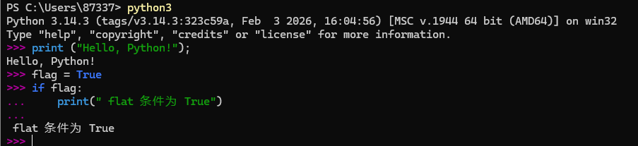

# 第五章: Python3 解释器

[[toc]]

> 说在前面的话，本文为个人学习[Python3 教程](https://www.runoob.com/python3/python3-tutorial.html)后进行总结的文章，本文主要用于<b>Python3基础知识</b>。

## 1.Python3 解释器

> Linux/Unix的系统上，一般默认的 python 版本为 2.x，我们可以将 python3.x 安装在 **/usr/local/python3** 目录中。
>
> 安装完成后，我们可以将路径 **/usr/local/python3/bin** 添加到您的 Linux/Unix 操作系统的环境变量中，这样您就可以通过 shell 终端输入下面的命令来启动 Python3 。

```python
$ PATH=$PATH:/usr/local/python3/bin/python3    # 设置环境变量
$ python3 --version
Python 3.14.3
```

在Window系统下你可以通过以下命令来设置Python的环境变量，假设你的Python安装在 `C:\Python` 下:

```shell
set path=%path%;C:\python
```

## 2.Python3的编程模式

### 2.1 交互式编程

我们可以在命令提示符中输入"Python"命令来启动Python解释器：

```
$ python3
```

执行以上命令后，出现如下窗口信息：

```python
PS C:\Users\87337> python3
Python 3.14.3 (tags/v3.14.3:323c59a, Feb  3 2026, 16:04:56) [MSC v.1944 64 bit (AMD64)] on win32
Type "help", "copyright", "credits" or "license" for more information.
>>>
```

在 python 提示符中输入以下语句，然后按回车键查看运行效果：

```python
print ("Hello, Python!");
```

以上命令执行结果如下：

```python
Hello, Python!
```

当键入一个多行结构时，续行是必须的。我们可以看下如下 if 语句：

```python
>>> flag = True
>>> if flag :
...     print("flag 条件为 True!")
... 
flag 条件为 True!
```



### 2.2 脚本式编程

将如下代码拷贝至 **hello.py**文件中：

```python
print ("Hello, Python!");
```

通过以下命令执行该脚本：

```python
python3 hello.py
```

输出结果为：

```python
Hello, Python!
```

在Linux/Unix系统中，你可以在脚本顶部添加以下命令让Python脚本可以像SHELL脚本一样可直接执行：

```python
#! /usr/bin/env python3
```

然后修改脚本权限，使其有执行权限，命令如下：

```python
$ chmod +x hello.pypython
```

执行以下命令：

```python
./hello.py
```

输出结果为：

```python
Hello, Python!
```

## 3.Python 其他解释器

> Python 解释器可不止一种哦，有 CPython、IPython、Jython、PyPy 等。
>
> 顾名思义，CPython 就是用 C 语言开发的了，是官方标准实现，拥有良好的生态，所以应用也就最为广泛了。
>
> 而 IPython 是在 CPython 的基础之上在交互式方面得到增强的解释器（http://ipython.org/）。
>
> Jython 是专为 Java 平台设计的 Python 解释器（http://www.jython.org/），它把 Python 代码编译成 Java 字节码执行。
>
> PyPy 是 Python 语言（2.7.13和3.5.3）的一种快速、兼容的替代实现（http://pypy.org/），以速度快著称。