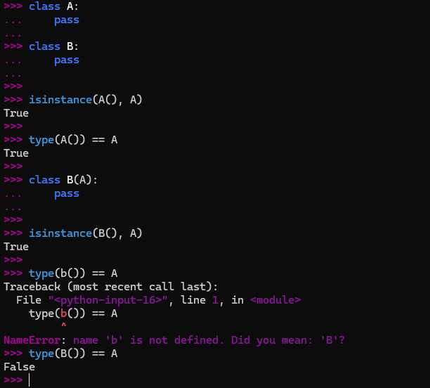
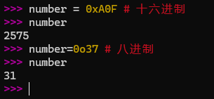

# 第七章: Python3 数字类型(Number)

[[toc]]

> 说在前面的话，本文为个人学习[Python3 教程](https://www.runoob.com/python3/python3-tutorial.html)后进行总结的文章，本文主要用于<b>Python3基础知识</b>。

## 1. Python3 数字数据类型 (Number)

> - Python 数字数据类型用于存储数值。
> - 数据类型是不允许改变的，这就意味着如果改变数字数据类型的值，将重新分配内存空间。
> - 像大多数语言一样，数值类型的赋值和计算都是很直观的。

### 1.1 数字数据类型赋值

>  以下实例在变量赋值时 Number 对象将被创建：

```python
var1 = 1
var2 = 10
```

### 1.2 数字数据类型删除

> 您也可以使用`del`语句删除一些数字对象的引用。 
>
> del语句的语法是：
>
> ```python
> del var1[,var2[,var3[....,varN]]]
> ```

您可以通过使用del语句删除单个或多个对象的引用，例如：

```python
del var
del var_a, var_b
```

## 2. 数字数据类型分类

### 2.1 分类介绍和演示示例

> Python 支持三种不同的数值类型：
>
> - **整型(int)** - 通常被称为是整型或整数，是正或负整数，不带小数点。Python3 整型是没有限制大小的，可以当作 Long 类型使用，所以 Python3 没有 Python2 的 Long 类型。布尔(`bool`)是整型的子类型。在Python 3里，只有一种整数类型 int，表示为长整型，没有 python2 中的 Long。
> - **浮点型(float)** - 浮点型由整数部分与小数部分组成，浮点型也可以使用科学计数法表示： (2.5e2 = 2.5 * $2^{10}$ = 250)
> - **复数 (complex)** - 复数由实数部分和虚数部分构成，可以用`a + bj`,或者`complex(a,b)`表示， 复数的实部a和虚部b都是浮点型。
>
> - 内置的 `type()` 函数可以用来查询变量所指的对象类型; 此外还可以用 `isinstance `来判断：
>
> - 我们可以使用十六进制和八进制来代表整数：

代码示例如下:

```python
>>> a, b, c, d = 20, 5.5, True, 4+3j
>>> print(type(a), type(b), type(c), type(d))
<class 'int'> <class 'float'> <class 'bool'> <class 'complex'>
```

使用`isinstance`来判断的实例如下：  // 这里判断的是身份

```python
>>> a = 111
>>> isinstance(a, int)
True
>>>
```

`isinstance `和 `type`的区别在于：

- `type()`不会认为子类是一种父类类型。
- `isinstance()`会认为子类是一种父类类型。

演示示例如下：

```python
>>> class A:
...     pass
... 
>>> class B(A):
...     pass
... 
>>> isinstance(A(), A)
True
>>> type(A()) == A 
True
>>> isinstance(B(), A)
True
>>> type(B()) == A
False
```



我们可以使用十六进制和八进制来代表整数：

代码示例如下：

```python
>>> number = 0xA0F # 十六进制
>>> number
2575

>>> number=0o37 # 八进制
>>> number
31
```



### 2.2 分类数值范围

| int    | float      | complex    |
| ------ | ---------- | ---------- |
| 10     | 0.0        | 3.14j      |
| 100    | 15.20      | 45.j       |
| -786   | -21.9      | 9.322e-36j |
| 080    | 32.3e+18   | .876j      |
| -0490  | -90.       | -.6545+0J  |
| -0x260 | -32.54e100 | 3e+26J     |
| 0x69   | 70.2E-12   | 4.53e-7j   |

### 2.3 数字运算

#### 2.3.1  加减乘除、取余、取商、乘方(幂) 运算

```python
>>> 5 + 4  # 加法
9
>>> 4.3 - 2 # 减法
2.3
>>> 3 * 7  # 乘法
21
>>> 2 / 4  # 除法，得到一个浮点数
0.5
>>> 2 // 4 # 除法，得到一个整数(取商)
0
>>> 17 % 3 # 取余
2
>>> 2 ** 5 # 乘方(幂)
32
```

> **注意：**
>
> - 1、Python可以同时为多个变量赋值，如a, b = 1, 2。
> - 2、一个变量可以通过赋值指向不同类型的对象。
> - 3、数值的除法包含两个运算符：/ 返回一个浮点数，// 返回一个整数。
> - 4、在混合计算时，Python会把整型转换成为浮点数。

#### 2.3.2 运算的各种实例

Python 解释器可以作为一个简单的计算器，您可以在解释器里输入一个表达式，它将输出表达式的值。

表达式的语法很直白： +, -, * 和 /, 和其它语言（如Pascal或C）里一样。例如：

```python
>>> 2 + 2
4
>>> 50 - 5*6
20
>>> (50 - 5*6) / 4
5.0
>>> 8 / 5  # 总是返回一个浮点数
1.6
```

**注意：**在不同的机器上浮点运算的结果可能会不一样。

在整数除法中，除法 / 总是返回一个浮点数，如果只想得到整数的结果，丢弃可能的分数部分，可以使用运算符  //  ：

```python
>>> 17 / 3  # 整数除法返回浮点型
5.666666666666667
>>>
>>> 17 // 3  # 整数除法返回向下取整后的结果
5
>>> 17 % 3  # ％操作符返回除法的余数
2
>>> 5 * 3 + 2 
17
```

**注意：**// 得到的并不一定是整数类型的数，它与分母分子的数据类型有关系。

```python
>>> 7//2
3
>>> 7.0//2
3.0
>>> 7//2.0
3.0
>>> 
```

等号 = 用于给变量赋值。赋值之后，除了下一个提示符，解释器不会显示任何结果。

```python
>>> width = 20
>>> height = 5*9
>>> width * height
900
```

Python 可以使用  **  操作来进行幂运算：

```python
>>> 5 ** 2  # 5 的平方
25
>>> 2 ** 7  # 2的7次方
128
```

变量在使用前必须先"定义"（即赋予变量一个值），否则会出现错误：

```python
>>> n   # 尝试访问一个未定义的变量
Traceback (most recent call last):
  File "<stdin>", line 1, in <module>
NameError: name 'n' is not defined
```

不同类型的数混合运算时会将整数转换为浮点数：

```python
>>> 3 * 3.75 / 1.5
7.5
>>> 7.0 / 2
3.5
```

在交互模式中，最后被输出的表达式结果被赋值给变量 **_** 。例如：

```python
>>> tax = 12.5 / 100
>>> price = 100.50
>>> price * tax
12.5625
>>> price + _
113.0625
>>> round(_, 2)
113.06
```

此处， **_** 变量应被用户视为只读变量。

## 3.数学函数

| 函数                                                         | 返回值 ( 描述 )                                              |
| ------------------------------------------------------------ | ------------------------------------------------------------ |
| [abs(x)](https://www.runoob.com/python3/python3-func-number-abs.html) | 返回数字的绝对值，如abs(-10) 返回 10                         |
| [ceil(x) ](https://www.runoob.com/python3/python3-func-number-ceil.html) | 返回数字的上入整数，如math.ceil(4.1) 返回 5                  |
| cmp(x, y)                                                    | 如果 x < y 返回 -1, 如果 x == y 返回 0, 如果 x > y 返回 1。 **Python 3 已废弃，使用 (x>y)-(x<y) 替换**。 |
| [exp(x) ](https://www.runoob.com/python3/python3-func-number-exp.html) | 返回e的x次幂(ex),如math.exp(1) 返回2.718281828459045         |
| [fabs(x)](https://www.runoob.com/python3/python3-func-number-fabs.html) | 以浮点数形式返回数字的绝对值，如math.fabs(-10) 返回10.0      |
| [floor(x) ](https://www.runoob.com/python3/python3-func-number-floor.html) | 返回数字的下舍整数，如math.floor(4.9)返回 4                  |
| [log(x) ](https://www.runoob.com/python3/python3-func-number-log.html) | 如math.log(math.e)返回1.0,math.log(100,10)返回2.0            |
| [log10(x) ](https://www.runoob.com/python3/python3-func-number-log10.html) | 返回以10为基数的x的对数，如math.log10(100)返回 2.0           |
| [max(x1, x2,...) ](https://www.runoob.com/python3/python3-func-number-max.html) | 返回给定参数的最大值，参数可以为序列。                       |
| [min(x1, x2,...) ](https://www.runoob.com/python3/python3-func-number-min.html) | 返回给定参数的最小值，参数可以为序列。                       |
| [modf(x) ](https://www.runoob.com/python3/python3-func-number-modf.html) | 返回x的整数部分与小数部分，两部分的数值符号与x相同，整数部分以浮点型表示。 |
| [pow(x, y)](https://www.runoob.com/python3/python3-func-number-pow.html) | x**y 运算后的值。                                            |
| [round(x [,n\])](https://www.runoob.com/python3/python3-func-number-round.html) | 返回浮点数 x 的四舍五入值，如给出 n 值，则代表舍入到小数点后的位数。 **其实准确的说是保留值将保留到离上一位更近的一端。** |
| [sqrt(x) ](https://www.runoob.com/python3/python3-func-number-sqrt.html) | 返回数字x的平方根。                                          |

## 4. 随机函数

随机数可以用于数学，游戏，安全等领域中，还经常被嵌入到算法中，用以提高算法效率，并提高程序的安全性。

Python包含以下常用随机数函数：

| 函数                                                         | 描述                                                         |
| ------------------------------------------------------------ | ------------------------------------------------------------ |
| [choice(seq)](https://www.runoob.com/python3/python3-func-number-choice.html) | 从序列的元素中随机挑选一个元素，比如`random.choice(range(10))`，从0到9中随机挑选一个整数。 |
| [randrange ([start,\] stop [,step]) ](https://www.runoob.com/python3/python3-func-number-randrange.html) | 从指定范围内，按指定基数递增的集合中获取一个随机数，基数默认值为 1 |
| [random() ](https://www.runoob.com/python3/python3-func-number-random.html) | 随机生成下一个实数，它在[0,1)范围内。                        |
| [seed([x])](https://www.runoob.com/python3/python3-func-number-seed.html) | 改变随机数生成器的种子seed。如果你不了解其原理，你不必特别去设定seed，Python会帮你选择seed。 |
| [shuffle(lst) ](https://www.runoob.com/python3/python3-func-number-shuffle.html) | 将序列的所有元素随机排序                                     |
| [uniform(x, y)](https://www.runoob.com/python3/python3-func-number-uniform.html) | 随机生成下一个实数，它在[x,y]范围内。                        |

## 5.三角函数

Python包括以下三角函数：

| 函数                                                         | 描述                                               |
| ------------------------------------------------------------ | -------------------------------------------------- |
| [acos(x)](https://www.runoob.com/python3/python3-func-number-acos.html) | 返回x的反余弦弧度值。                              |
| [asin(x)](https://www.runoob.com/python3/python3-func-number-asin.html) | 返回x的反正弦弧度值。                              |
| [atan(x)](https://www.runoob.com/python3/python3-func-number-atan.html) | 返回x的反正切弧度值。                              |
| [atan2(y, x)](https://www.runoob.com/python3/python3-func-number-atan2.html) | 返回给定的 X 及 Y 坐标值的反正切值。               |
| [cos(x)](https://www.runoob.com/python3/python3-func-number-cos.html) | 返回x的弧度的余弦值。                              |
| [hypot(x, y)](https://www.runoob.com/python3/python3-func-number-hypot.html) | 返回欧几里德范数 sqrt(x*x + y*y)。                 |
| [sin(x)](https://www.runoob.com/python3/python3-func-number-sin.html) | 返回的x弧度的正弦值。                              |
| [tan(x)](https://www.runoob.com/python3/python3-func-number-tan.html) | 返回x弧度的正切值。                                |
| [degrees(x)](https://www.runoob.com/python3/python3-func-number-degrees.html) | 将弧度转换为角度,如degrees(math.pi/2) ，  返回90.0 |
| [radians(x)](https://www.runoob.com/python3/python3-func-number-radians.html) | 将角度转换为弧度                                   |

## 6.数字常量

| 常量 | 描述                                  |
| ---- | ------------------------------------- |
| pi   | 数学常量 pi（圆周率，一般以π来表示）  |
| e    | 数学常量 e，e即自然常数（自然常数）。 |

## 7.数字数据类型子类-布尔值(bool)

> 布尔类型即 `True` 或 `False`。
>
> 在 Python 中，`True`和 `False` 都是关键字，表示布尔值。
>
> <b>布尔类型</b>可以用来控制程序的流程，比如判断某个条件是否成立，或者在某个条件满足时执行某段代码。
>
> <b>布尔类型</b>特点：
>
> - <b>布尔类型</b>只有两个值：`True` 和 `False`。
> - bool 是 int 的子类，因此布尔值可以被看作整数来使用，其中 True 等价于 1。
> - <b>布尔类型</b>可以和其他数据类型进行比较，比如数字、字符串等。在比较时，Python 会将 True 视为 1，False 视为 0。
> - <b>布尔类型</b>可以和逻辑运算符一起使用，包括 and、or 和 not。这些运算符可以用来组合多个布尔表达式，生成一个新的布尔值。
> - <b>布尔类型</b>也可以被转换成其他数据类型，比如整数、浮点数和字符串。在转换时，True 会被转换成 1，False 会被转换成 0。
> - 可以使用 `bool()` 函数将其他类型的值转换为布尔值。以下值在转换为布尔值时为 `False`：`None`、`False`、零 (`0`、`0.0`、`0j`)、空序列（如 `''`、`()`、`[]`）和空映射（如 `{}`）。其他所有值转换为布尔值时均为 `True`。

实例如下：

```python
#!/usr/bin/python3

# 布尔类型的值和类型
a=True
b=False
print(type(a))  # <class 'bool'>
print(type(b))  # <class 'bool'>

# 布尔类型的整数表现
print(int(True))   # 1
print(int(False))  # 0

# 使用 bool() 函数进行转换
'''
在 Python 中，所有非零的数字和非空的字符串、列表、元组等数据类型都被视为 True，只有 0、空字符串、空列表、空元组等被视为 False。
因此，在进行布尔类型转换时，需要注意数据类型的真假性。
'''

print(bool(0))          # False
print(bool(42))         # True
print(bool(''))         # False
print(bool('Python'))   # True
print(bool([]))         # False
print(bool([1, 2, 3]))  # True

# 布尔逻辑运算
print(True and False)  # False
print(True or False)  # True
print(not True)  # False

# 布尔比较运算
print(5 > 3)  # True
print(2 == 2)  # True
print(7 < 4)  # False

# 布尔值在控制流中的应用
if True:
    print("This will always print")

if not False:
    print("This will also always print")

x = 10
if x:
    print("x is non-zero and thus True in a boolean context")

```

执行结果如下：

```python
<class 'bool'>
<class 'bool'>
1
0
False
True
False
True
False
True
False
True
False
True
True
False
This will always print
This will also always print
x is non-zero and thus True in a boolean context
```

