# 第八章: Python3 字符串类型(String)

[[toc]]

> 说在前面的话，本文为个人学习[Python3 教程](https://www.runoob.com/python3/python3-tutorial.html)后进行总结的文章，本文主要用于<b>Python3基础知识</b>。

## 1. 字符串

> 字符串是 Python 中最常用的数据类型。我们可以使用引号( `'` 或 `"` )来创建字符串。

### 1.1 创建字符串

> 创建字符串很简单，只要为变量分配一个值即可。例如：
>
> ```python
> a='Hello World'
> b="Hello Python3"
> print(a, b)
> ```
>
> 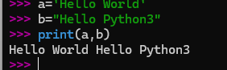

### 1.2 访问字符串中的值

> Python 不支持单字符类型，单字符在 Python 中也是作为一个字符串使用。
>
> Python 访问子字符串，可以使用方括号 [] 来截取字符串，字符串的截取的语法格式如下：
>
> ```python
> 变量[头下标:尾下标]
> ```
>
> 索引值以 **0** 为开始值，**-1** 为从末尾的开始位置。
>
> 以字符串"Runoob"这个字符串为例子，图解它的访问如下图所示：
>
> 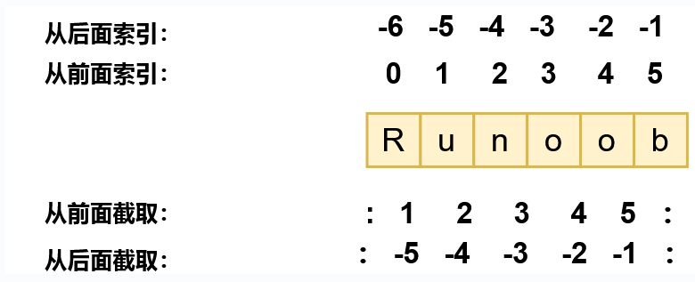
>
> 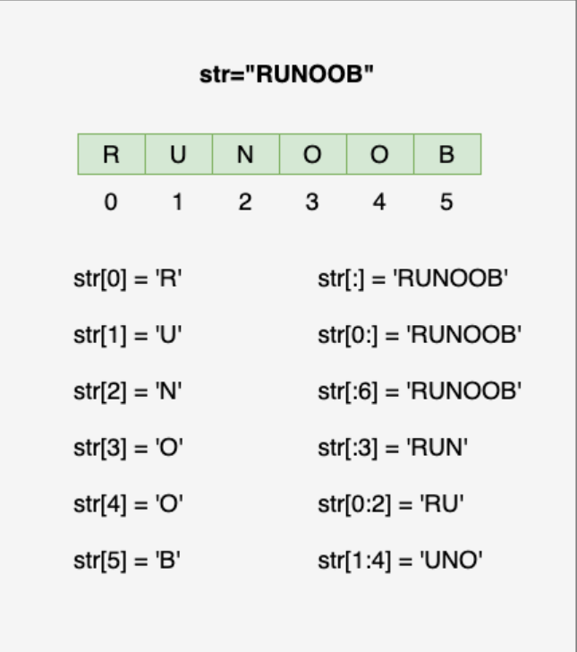

实例如下:

```python
#!/usr/bin/python3

str = "Runoob"  # 定义1个字符串变量
str1 = "Hello world" # 定义第二个字符串变量

print ("str[0]: ", str[0]) # 打印字符串第一个字符
print ("str1[1:5]: ", str1[1:5])  # 打印字符串第二个到第五个个字符不包含索引为5的字符

## 下面进行访问字符串中的值

print(str)           # 打印整个字符串
print(str[0:-1])     # 打印字符串第一个到倒数第二个字符（不包含倒数第一个字符）
print(str[0])        # 打印字符串的第一个字符
print(str[2:5])      # 打印字符串第三到第五个字符（不包含索引为 5 的字符）
print(str[2:])       # 打印字符串从第三个字符开始到末尾
print(str * 2)       # 打印字符串两次
print(str + "TEST")  # 打印字符串和"TEST"拼接在一起 
```

执行后结果如下：

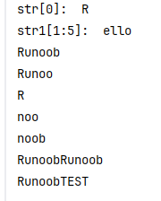

### 1.3 访问字符串的值特殊处理

#### 1.3.1 `+` 拼接字符串

> 加号  +  是字符串的连接符

实例如下:

```python
#!/usr/bin/python3

str = "Runoob"  # 定义1个字符串变量
print(str + "TEST")  # 打印字符串和"TEST"拼接在一起 
```

执行结果如下：

```python
RunoobTEST
```

#### 1.3.2 `*` 复制字符串

> 星号  *  表示复制当前字符串，与之结合的数字为复制的次数。

实例如下:

```python
#!/usr/bin/python3

str = "Runoob"  # 定义1个字符串变量
print(str * 2)  # 打印字符串两次
```

执行结果如下：

```python
RunoobRunoob
```

#### 1.3.3  `\` 转义字符处理

> Python 使用反斜杠 `\`转义特殊字符，如果你不想让反斜杠发生转义，可以在字符串前面添加一个 `r`，表示原始字符串：

实例如下：

```python
#!/usr/bin/python3

print("He\nllo")  # 包含转义字符          这个会换行
print(r"He\nllo") # 字符串前加了r			这个不会换行，会把转义字符也打印处理啊
```

执行结果如下：

```python
He
llo
He\nllo
```

> 另外，反斜杠(`\`)可以作为续行符，表示下一行是上一行的延续。也可以使用 **"""..."""** 或者 **'''...'''** 跨越多行。

```python
#!/usr/bin/python3
str = "hello  
		\ world"
```

总结：

- Python 没有单独的字符类型，一个字符就是长度为1的字符串。
- 反斜杠可以用来转义，使用r可以让反斜杠不发生转义。
- 字符串可以用+运算符连接在一起，用*运算符重复。
- Python中的字符串有两种索引方式，从左往右以0开始到N-1结束，从右往左以-1开始到-N结束。
- Python中的<font style="color:red">字符串不能改变</font>。

### 1.4 字符串更新

>  你可以截取字符串的一部分并与其他字段拼接，如下实例：

```python
#!/usr/bin/python3  
var1 = 'Hello World!'
print ("已更新字符串 : ", var1[:6] + 'Runoob!')
```

以上实例执行结果

```
已更新字符串 :  Hello Runoob!
```

::: warning

本质： 新创建了新的字符串对象。

:::

## 2. 字符串中的转义字符

> 在需要在字符中使用特殊字符时，python 用反斜杠 `\` 转义字符。如下表：

| 转义字符    | 描述                                                         | 实例                                                         |
| ----------- | ------------------------------------------------------------ | ------------------------------------------------------------ |
| \(在行尾时) | 续行符                                                       | `>>> print("line1 \<br/>...         line2 \<br/>...         line3")<br/>line1         line2         line3`  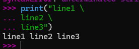 |
| \\          | 反斜杠符号                                                   | `>>> print("\\") \`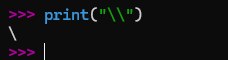 |
| \'          | 单引号                                                       | `>>> print('\'') '`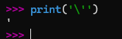 |
| \"          | 双引号                                                       | `>>> print("\"") "` |
| \a          | 响铃                                                         | `>>> print("\a")`    执行后电脑有响声。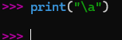 |
| \b          | 退格(Backspace)                                              | `>>> print("Hello \b World!")Hello World!`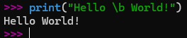 |
| \000        | 空                                                           | `>>> print("\000") >>> `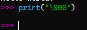 |
| \n          | 换行                                                         | `>>> print("\n")  >>>`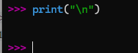 |
| \v          | 纵向制表符                                                   | `>>> print("Hello \v World!") Hello        World! >>>`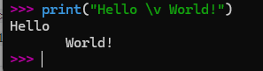 |
| \t          | 横向制表符                                                   | `>>> print("Hello \t World!") Hello    World! >>>`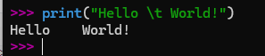 |
| \r          | 回车，将 \r 后面的内容移到字符串开头，并逐一替换开头部分的字符，直至将 \r 后面的内容完全替换完成。 | `>>> print("Hello\rWorld!") World! >>> print('google runoob taobao\r123456') 123456 runoob taobao`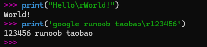 |
| \f          | 换页                                                         | `>>> print("Hello \f World!") Hello        World! >>> `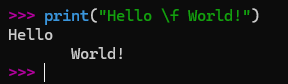 |
| \yyy        | 八进制数，y 代表 0~7 的字符，例如：\012 代表换行。           | `>>> print("\110\145\154\154\157\40\127\157\162\154\144\41") Hello World!`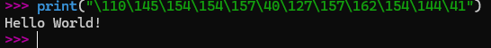 |
| \xyy        | 十六进制数，以 \x 开头，y 代表的字符，例如：\x0a 代表换行    | `>>> print("\x48\x65\x6c\x6c\x6f\x20\x57\x6f\x72\x6c\x64\x21") Hello World!`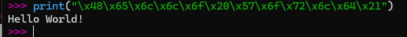 |
| \other      | 其它的字符以普通格式输出                                     |                                                              |

实例一：使用 `\r` 实现百分比进度：

```python
import time

for i in range(101): # 添加进度条图形和百分比
    bar = '[' + '=' * (i // 2) + ' ' * (50 - i // 2) + ']'
    print(f"\r{bar} {i:3}%", end='', flush=True)
    time.sleep(0.05)
print()
```

执行后生成的动态图解如下：

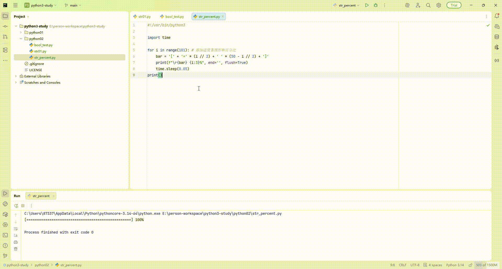

实例二：以下实例，我们使用了不同的转义字符来演示单引号、换行符、制表符、退格符、换页符、ASCII、二进制、八进制数和十六进制数的效果：

```python
#!/usr/bin/python3

print('\'Hello, world!\'')  # 输出：'Hello, world!'

print("Hello, world!\nHow are you?")  # 输出：Hello, world!
                                        #       How are you?

print("Hello, world!\tHow are you?")  # 输出：Hello, world!    How are you?

print("Hello,\b world!")  # 输出：Hello world!

print("Hello,\f world!")  # 输出：
                           # Hello,
                           #  world!

print("A 对应的 ASCII 值为：", ord('A'))  # 输出：A 对应的 ASCII 值为： 65

print("\x41 为 A 的 ASCII 代码")  # 输出：A 为 A 的 ASCII 代码

decimal_number = 42
binary_number = bin(decimal_number)  # 十进制转换为二进制
print('转换为二进制:', binary_number)  # 转换为二进制: 0b101010

octal_number = oct(decimal_number)  # 十进制转换为八进制
print('转换为八进制:', octal_number)  # 转换为八进制: 0o52

hexadecimal_number = hex(decimal_number)  # 十进制转换为十六进制
print('转换为十六进制:', hexadecimal_number) # 转换为十六进制: 0x2a
```

执行后的结果如下：

```python
'Hello, world!'
Hello, world!
How are you?
Hello, world!	How are you?
Hello world!
Hello, world!
A 对应的 ASCII 值为： 65
A 为 A 的 ASCII 代码
转换为二进制: 0b101010
转换为八进制: 0o52
转换为十六进制: 0x2a
```

## 3.字符串的运算符

> 下表实例变量 a 值为字符串 "Hello"，b 变量值为 "Python"：

| 操作符 | 描述                                                         | 实例                               |
| ------ | ------------------------------------------------------------ | ---------------------------------- |
| +      | 字符串连接                                                   | a + b 输出结果： HelloPython       |
| *      | 重复输出字符串                                               | a*2 输出结果：HelloHello           |
| []     | 通过索引获取字符串中字符                                     | a[1] 输出结果 **e**                |
| [ : ]  | 截取字符串中的一部分，遵循**左闭右开**原则，str[0:2] 是不包含第 3 个字符的。 | a[1:4] 输出结果 **ell**            |
| in     | 成员运算符 - 如果字符串中包含给定的字符返回 True             | **'H' in a** 输出结果 True         |
| not in | 成员运算符 - 如果字符串中不包含给定的字符返回 True           | **'M' not in a** 输出结果 True     |
| r/R    | 原始字符串 - 原始字符串：所有的字符串都是直接按照字面的意思来使用，没有转义特殊或不能打印的字符。 原始字符串除在字符串的第一个引号前加上字母 r（可以大小写）以外，与普通字符串有着几乎完全相同的语法。 | `print( r'\n' ) print( R'\n' )`    |
| %      | 格式字符串                                                   | [请跳转到第四节](#_4-字符串格式化) |

实例如下：

```python
#!/usr/bin/python3
# 字符串的运算符

a = "Hello"
b = "Python"

# + 字符串连接
print("a + b 输出结果：", a + b)

# *	重复输出字符串
print("a * 2 输出结果：", a * 2)

# []	通过索引获取字符串中字符
print("a[1] 输出结果：", a[1])

# [ : ]	截取字符串中的一部分，遵循左闭右开原则，str[0:2] 是不包含第 3 个字符的。
print("a[1:4] 输出结果：", a[1:4])

# in	成员运算符 - 如果字符串中包含给定的字符返回 True
if ("H" in a):
    print("H 在变量 a 中")
else:
    print("H 不在变量 a 中")

# not in 	成员运算符 - 如果字符串中不包含给定的字符返回 True
if ("M" not in a):
    print("M 不在变量 a 中")
else:
    print("M 在变量 a 中")

# r/R	原始字符串 - 原始字符串：所有的字符串都是直接按照字面的意思来使用，没有转义特殊或不能打印的字符。
# 原始字符串除在字符串的第一个引号前加上字母 r（可以大小写）以外，与普通字符串有着几乎完全相同的语法。
print(r'\n')
print(R'\n')
```

执行后的结果如下:

```python
a + b 输出结果： HelloPython
a * 2 输出结果： HelloHello
a[1] 输出结果： e
a[1:4] 输出结果： ell
H 在变量 a 中
M 不在变量 a 中
\n
\n
```

## 4.字符串格式化

> Python 支持格式化字符串的输出 。
>
> 尽管这样可能会用到非常复杂的表达式，但最基本的用法是将一个值插入到一个有字符串格式符 `%s` 的字符串中。

### 4.1 `%s` 格式化

> 在 Python 中，字符串格式化使用与 C 中 sprintf 函数一样的语法。

实例如下：

```python
#!/usr/bin/python3
 
print ("我叫 %s 今年 %d 岁!" % ('小明', 10))
```

执行结果如下：

```python
我叫 小明 今年 10 岁!
```

### 4.2 字符串格式化符号

python字符串格式化符号:

| 符  号 | 描述                                 |
| ------ | ------------------------------------ |
| %c     | 格式化字符及其ASCII码                |
| %s     | 格式化字符串                         |
| %d     | 格式化整数                           |
| %u     | 格式化无符号整型                     |
| %o     | 格式化无符号八进制数                 |
| %x     | 格式化无符号十六进制数               |
| %X     | 格式化无符号十六进制数（大写）       |
| %f     | 格式化浮点数字，可指定小数点后的精度 |
| %e     | 用科学计数法格式化浮点数             |
| %E     | 作用同%e，用科学计数法格式化浮点数   |
| %g     | %f和%e的简写                         |
| %G     | %f 和 %E 的简写                      |
| %p     | 用十六进制数格式化变量的地址         |

格式化操作符辅助指令:

| 符号   | 功能                                                         |
| ------ | ------------------------------------------------------------ |
| *      | 定义宽度或者小数点精度                                       |
| -      | 用做左对齐                                                   |
| +      | 在正数前面显示加号( + )                                      |
| `<sp>` | 在正数前面显示空格                                           |
| #      | 在八进制数前面显示零('0')，在十六进制前面显示'0x'或者'0X'(取决于用的是'x'还是'X') |
| 0      | 显示的数字前面填充'0'而不是默认的空格                        |
| %      | '%%'输出一个单一的'%'                                        |
| (var)  | 映射变量(字典参数)                                           |
| m.n.   | m 是显示的最小总宽度,n 是小数点后的位数(如果可用的话)        |

Python2.6 开始，新增了一种格式化字符串的函数 [str.format()](https://www.runoob.com/python/att-string-format.html)，它增强了字符串格式化的功能。

实例如下:

```python
#! /usr/bin/python3

# 字符串格式化

# %s 格式化字符串   %d 格式化整数
print("我叫 %s 今年 %d 岁!" % ('小明', 10))

#   %c 格式化字符及其ASCII码
char = 'A'
ascii_value = ord(char)  # 使用ord函数获取字符的ASCII码值
formatted_string = "The character is %c and its ASCII value is %d." % (char,ascii_value)
print(formatted_string)  # 输出: The character is A and its ASCII value is 65.

# %u 格式化无符号整型
num = 123
formatted_num = "%u" % num
print(formatted_num)  # 输出: 123

#    %o 格式化无符号八进制数
num = 255
# 使用格式化方法
octal_str = "%o" % num
print(octal_str)  # 输出: 377

# %x 格式化无符号十六进制数
num = 255
hex_str = "{:#x}".format(num)
print(hex_str)  # 输出: 0xff

# %X 格式化无符号十六进制数（大写）
number = 255
formatted_hex = "%X" % number
print(formatted_hex)  # 输出: FF

#  %f 格式化浮点数字，可指定小数点后的精度
num = 3.14159265
# 指定小数点后两位
formatted_num = "%.2f" % num
print(formatted_num)  # 输出: 3.14

#  %e 用科学计数法格式化浮点数
num = 123456789.123456789
formatted_num = "%e" % num
print(formatted_num)  # 输出: 1.234568e+08

#   %E 作用同%e，用科学计数法格式化浮点数
number = 12345.6789
formatted_number = "%E" % number
print(formatted_number)  # 输出: 1.234568E+04

# %g %f和%e的简写
num_int = 123
num_float = 123.456789
num_scientific = 1234.56789

print("整数: %d" % num_int)
print("浮点数: %f" % num_float)
print("科学计数法: %e" % num_scientific)

#  %G %f 和 %E 的简写
number = 123.456789

# 使用 %f
formatted_f = "%f" % number
print("Formatted with %f:", formatted_f)

# 使用 %E
formatted_E = "%E" % number
print("Formatted with %E:", formatted_E)

# 使用 %G
formatted_G = "%G" % number
print("Formatted with %G:", formatted_G)

# str.format 增加字符串的格式化  例子
name = "Alice"
age = 30

# 使用 {} 作为占位符
message = "Hello, {}. You are {} years old.".format(name, age)
print(message)

name = "Bob"
age = 25

# 使用索引 [0] 和 [1] 对应位置参数
message = "Hello, {0}. You are {1} years old.".format(name, age)
print(message)

# 使用关键字参数，更清晰
message = "Hello, {name}. You are {age} years old.".format(name=name, age=age)
print(message)
```

执行结果如下:

```python
我叫 小明 今年 10 岁!
The character is A and its ASCII value is 65.
123
377
0xff
FF
3.14
1.234568e+08
1.234568E+04
整数: 123
浮点数: 123.456789
科学计数法: 1.234568e+03
Formatted with %f: 123.456789
Formatted with %E: 1.234568E+02
Formatted with %G: 123.457
Hello, Alice. You are 30 years old.
Hello, Bob. You are 25 years old.
Hello, Bob. You are 25 years old.
```

## 5. 三引号

> python三引号允许一个字符串跨多行，字符串中可以包含换行符、制表符以及其他特殊字符。

实例如下：

```python
#! /usr/bin/python3

# 三引号  允许一个字符串跨多行，字符串中可以包含换行符、制表符以及其他特殊字符。

test_str = """
这是一个三引号的实例字符串
可以跨行
包含换行符 Enter(\r\n)
制表符 Tab(\t) 以及其他特殊字符
12！@#￥%……&*（）——+“：《》《
"""
print(test_str)
```

执行后结果如下：

```python
这是一个三引号的实例字符串
可以跨行
包含换行符 Enter(
)
制表符 Tab(	) 以及其他特殊字符
12！@#￥%……&*（）——+“：《》《
```

> 三引号让程序员从引号和特殊字符串的泥潭里面解脱出来，自始至终保持一小块字符串的格式是所谓的WYSIWYG（所见即所得）格式的。
>
> 一个典型的用例是，当你需要一块HTML或者SQL时，这时用字符串组合，特殊字符串转义将会非常的繁琐。

实际案例如下：

```python
errHTML = '''
<HTML><HEAD><TITLE>
Friends CGI Demo</TITLE></HEAD>
<BODY><H3>ERROR</H3>
<B>%s</B><P>
<FORM><INPUT TYPE=button VALUE=Back
ONCLICK="window.history.back()"></FORM>
</BODY></HTML>
'''
cursor.execute('''
CREATE TABLE users (  
login VARCHAR(8), 
uid INTEGER,
prid INTEGER)
''')
```

## 6.`f-string`

> `f-string` 是 `python3.6` 之后版本添加的，称之为字面量格式化字符串，是新的格式化字符串的语法。

之前我们习惯用百分号 (%):

```python
#! /usr/bin/python3

# f-string

# 以前用 % 形式

name = "Python"

format = "Hello %s" % name
print(format)
```

执行结果如下：

```python
Hello Python
```

>  现在我们使用`f-string`形式，**`f-string`** 格式化字符串以 `f`开头，后面跟着字符串，字符串中的表达式用大括号 {} 包起来，它会将变量或表达式计算后的值替换进去

实例如下：

```python
#! /usr/bin/python3

# f-string

# 以前用 % 形式

name = "Python"

format = "Hello %s" % name
print(format)

# 现在使用 f-string

format1 = f"Hello, {name}!"  # {} 替换变量
print(format1)

# 格式化表达式
print(f"1+2+3+4+5+6+7+8+9+10+11+12")

# 格式化map
w = {"name": "Bob", "age": 25}
print(w["name"])
print(w["age"])
print(f"{w['name']} : {w['age']}")
```

执行结果如下：

```py
Hello Python
Hello, Python!
1+2+3+4+5+6+7+8+9+10+11+12
Bob
25
Bob : 25
```

::: info 好处

用了这种方式明显更简单了，不用再去判断使用 `%s`，还是 `%d`。

:::

> 在 Python 3.8 的版本中可以使用 `=` 符号来拼接运算表达式与结果

实例如下：

```python
# python 3.6
x=1
print(f'{x+1}')

#python3.8+
x=1
print(f'{x+1=}')
```

执行后结果如下：

```python
2
x+1=2
```

## 7.Unicode 字符串

> 在`Python2`中，普通字符串是以8位ASCII码进行存储的，而Unicode字符串则存储为16位unicode字符串，这样能够表示更多的字符集。使用的语法是在字符串前面加上前缀 **u**。
>
> 在`Python3`中，所有的字符串都是Unicode字符串。

## 8.Python 的字符串内建函数

Python 的字符串常用内建函数如下：

| 序号 | 方法及描述                                                   |
| ---- | ------------------------------------------------------------ |
| 1    | [capitalize()](https://www.runoob.com/python3/python3-string-capitalize.html) 将字符串的第一个字符转换为大写 |
| 2    | [center(width, fillchar)](https://www.runoob.com/python3/python3-string-center.html) 返回一个指定的宽度 width 居中的字符串，fillchar 为填充的字符，默认为空格。 |
| 3    | [count(str, beg= 0,end=len(string))](https://www.runoob.com/python3/python3-string-count.html) 返回 str 在 string 里面出现的次数，如果 beg 或者 end 指定则返回指定范围内 str 出现的次数 |
| 4    | [bytes.decode(encoding="utf-8", errors="strict")](https://www.runoob.com/python3/python3-string-decode.html) Python3 中没有 decode 方法，但我们可以使用 bytes 对象的 decode() 方法来解码给定的 bytes 对象，这个 bytes 对象可以由 str.encode() 来编码返回。 |
| 5    | [encode(encoding='UTF-8',errors='strict')](https://www.runoob.com/python3/python3-string-encode.html) 以 encoding 指定的编码格式编码字符串，如果出错默认报一个ValueError 的异常，除非 errors 指定的是'ignore'或者'replace' |
| 6    | [endswith(suffix, beg=0, end=len(string))](https://www.runoob.com/python3/python3-string-endswith.html) 检查字符串是否以 suffix 结束，如果 beg 或者 end 指定则检查指定的范围内是否以 suffix 结束，如果是，返回 True,否则返回 False。 |
| 7    | [expandtabs(tabsize=8)](https://www.runoob.com/python3/python3-string-expandtabs.html) 把字符串 string 中的 tab 符号转为空格，tab 符号默认的空格数是 8 。 |
| 8    | [find(str, beg=0, end=len(string))](https://www.runoob.com/python3/python3-string-find.html) 检测 str 是否包含在字符串中，如果指定范围 beg 和 end ，则检查是否包含在指定范围内，如果包含返回开始的索引值，否则返回-1 |
| 9    | [index(str, beg=0, end=len(string))](https://www.runoob.com/python3/python3-string-index.html) 跟find()方法一样，只不过如果str不在字符串中会报一个异常。 |
| 10   | [isalnum()](https://www.runoob.com/python3/python3-string-isalnum.html) 检查字符串是否由字母和数字组成，即字符串中的所有字符都是字母或数字。如果字符串至少有一个字符，并且所有字符都是字母或数字，则返回 True；否则返回 False。 |
| 11   | [isalpha()](https://www.runoob.com/python3/python3-string-isalpha.html) 如果字符串至少有一个字符并且所有字符都是字母或中文字则返回 True, 否则返回 False |
| 12   | [isdigit()](https://www.runoob.com/python3/python3-string-isdigit.html) 如果字符串只包含数字则返回 True 否则返回 False.. |
| 13   | [islower()](https://www.runoob.com/python3/python3-string-islower.html) 如果字符串中包含至少一个区分大小写的字符，并且所有这些(区分大小写的)字符都是小写，则返回 True，否则返回 False |
| 14   | [isnumeric()](https://www.runoob.com/python3/python3-string-isnumeric.html) 如果字符串中只包含数字字符，则返回 True，否则返回 False |
| 15   | [isspace()](https://www.runoob.com/python3/python3-string-isspace.html) 如果字符串中只包含空白，则返回 True，否则返回 False. |
| 16   | [istitle()](https://www.runoob.com/python3/python3-string-istitle.html) 	 如果字符串是标题化的(见 title())则返回 True，否则返回 False |
| 17   | [isupper()](https://www.runoob.com/python3/python3-string-isupper.html) 如果字符串中包含至少一个区分大小写的字符，并且所有这些(区分大小写的)字符都是大写，则返回 True，否则返回 False |
| 18   | [join(seq)](https://www.runoob.com/python3/python3-string-join.html) 以指定字符串作为分隔符，将 seq 中所有的元素(的字符串表示)合并为一个新的字符串 |
| 19   | [len(string)](https://www.runoob.com/python3/python3-string-len.html) 返回字符串长度 |
| 20   | [ljust(width[, fillchar\])](https://www.runoob.com/python3/python3-string-ljust.html) 返回一个原字符串左对齐,并使用 fillchar 填充至长度 width 的新字符串，fillchar 默认为空格。 |
| 21   | [lower()](https://www.runoob.com/python3/python3-string-lower.html) 转换字符串中所有大写字符为小写. |
| 22   | [lstrip()](https://www.runoob.com/python3/python3-string-lstrip.html) 截掉字符串左边的空格或指定字符。 |
| 23   | [maketrans()](https://www.runoob.com/python3/python3-string-maketrans.html) 创建字符映射的转换表，对于接受两个参数的最简单的调用方式，第一个参数是字符串，表示需要转换的字符，第二个参数也是字符串表示转换的目标。 |
| 24   | [max(str)](https://www.runoob.com/python3/python3-string-max.html) 返回字符串 str 中最大的字母。 |
| 25   | [min(str)](https://www.runoob.com/python3/python3-string-min.html) 返回字符串 str 中最小的字母。 |
| 26   | [replace(old, new [, max\])](https://www.runoob.com/python3/python3-string-replace.html) 把 将字符串中的 old 替换成 new,如果 max 指定，则替换不超过 max 次。 |
| 27   | [rfind(str, beg=0,end=len(string))](https://www.runoob.com/python3/python3-string-rfind.html) 类似于 find()函数，不过是从右边开始查找. |
| 28   | [rindex( str, beg=0, end=len(string))](https://www.runoob.com/python3/python3-string-rindex.html) 类似于 index()，不过是从右边开始. |
| 29   | [rjust(width,[, fillchar\])](https://www.runoob.com/python3/python3-string-rjust.html) 返回一个原字符串右对齐,并使用fillchar(默认空格）填充至长度 width 的新字符串 |
| 30   | [rstrip()](https://www.runoob.com/python3/python3-string-rstrip.html) 删除字符串末尾的空格或指定字符。 |
| 31   | [split(str="", num=string.count(str))](https://www.runoob.com/python3/python3-string-split.html)  以 str 为分隔符截取字符串，如果 num 有指定值，则仅截取 num+1 个子字符串 |
| 32   | [splitlines([keepends\])](https://www.runoob.com/python3/python3-string-splitlines.html) 按照行('\r', '\r\n', \n')分隔，返回一个包含各行作为元素的列表，如果参数 keepends 为 False，不包含换行符，如果为 True，则保留换行符。 |
| 33   | [startswith(substr, beg=0,end=len(string))](https://www.runoob.com/python3/python3-string-startswith.html) 检查字符串是否是以指定子字符串 substr 开头，是则返回 True，否则返回 False。如果beg 和 end 指定值，则在指定范围内检查。 |
| 34   | [strip([chars\])](https://www.runoob.com/python3/python3-string-strip.html) 在字符串上执行 lstrip()和 rstrip() |
| 35   | [swapcase()](https://www.runoob.com/python3/python3-string-swapcase.html) 将字符串中大写转换为小写，小写转换为大写 |
| 36   | [title()](https://www.runoob.com/python3/python3-string-title.html) 返回"标题化"的字符串,就是说所有单词都是以大写开始，其余字母均为小写(见 istitle()) |
| 37   | [translate(table, deletechars="")](https://www.runoob.com/python3/python3-string-translate.html) 根据 table 给出的表(包含 256 个字符)转换 string 的字符, 要过滤掉的字符放到 deletechars 参数中 |
| 38   | [upper()](https://www.runoob.com/python3/python3-string-upper.html) 	 转换字符串中的小写字母为大写 |
| 39   | [zfill (width)](https://www.runoob.com/python3/python3-string-zfill.html) 返回长度为 width 的字符串，原字符串右对齐，前面填充0 |
| 40   | [isdecimal()](https://www.runoob.com/python3/python3-string-isdecimal.html)  检查字符串是否只包含十进制字符，如果是返回 true，否则返回 false。 |

实例如下:

```python
#! /usr/bin/python3

# 字符串内建函数

# 1.capitalize() 将字符串的第一个字符转换为大写
# 定义一个字符串
my_string = "hello world"
# 使用 capitalize() 方法
capitalized_string = my_string.capitalize()
# 输出结果
print(capitalized_string)  # 输出: Hello world

# 2.center(width, fillchar) 返回一个指定的宽度 width 居中的字符串，fillchar 为填充的字符，默认为空格。
# 示例1: 默认填充字符
text = "hello"
centered_text = text.center(10)
print(centered_text)  # 输出: "   hello   "

# 示例2: 指定填充字符
text = "hello"
centered_text = text.center(10, '-')
print(centered_text)  # 输出: "---hello---"

# 3.count(str, beg= 0,end=len(string)) 返回 str 在 string 里面出现的次数，
# 如果 beg 或者 end 指定则返回指定范围内 str 出现的次数
# str.count(sub[, start[, end]])
s = "hello world, hello Python"
count = s.count('hello')
print(count)  # 输出: 2

# 使用 start 和 end 参数
count_from_start = s.count('hello', 6)  # 从索引6开始计数
print(count_from_start)  # 输出: 1

# 使用 start 和 end 参数更精确地控制范围
count_in_range = s.count('hello', 6, 16)  # 从索引6到15（不包括16）
print(count_in_range)  # 输出: 1


# 4.bytes.decode(encoding="utf-8", errors="strict") Python3 中没有 decode 方法，
# 但我们可以使用 bytes 对象的 decode() 方法来解码给定的 bytes 对象，这个 bytes 对象可以由 str.encode() 来编码返回。
# 5.encode(encoding='UTF-8',errors='strict') 以 encoding 指定的编码格式编码字符串，如果出错默认报一个ValueError
# 的异常，除非 errors 指定的是'ignore'或者'replace'

# 定义一个字符串
s = "Hello, World!"
# 使用str.encode()方法将字符串编码为字节对象
b = s.encode()
# 打印结果
print(b)  # 输出: b'Hello, World!'
# 使用ASCII编码
b_ascii = s.encode('ascii')
print(b_ascii)  # 输出: b'Hello, World!'
# 定义一个字节对象
b = b'Hello, World!'
# 使用bytes.decode()方法将字节对象解码为字符串
s = b.decode()
# 打印结果
print(s)  # 输出: Hello, World!
# 使用ASCII解码
s_ascii = b_ascii.decode('ascii')
print(s_ascii)  # 输出: Hello, World!

# 编码和解码的组合使用
# 定义一个字符串
original_str = "你好，世界！"
# 将字符串编码为字节对象（例如使用UTF-8）
encoded_bytes = original_str.encode('utf-8')
print("Encoded bytes:", encoded_bytes)  # 输出: Encoded bytes: b'\xe4\xbd\xa0\xe5\xa5\xbd\xef\xbc\x8c\xe4\xb8\x96\xe7\x95\x8c\xef\xbc\x81'
# 将字节对象解码回字符串（使用相同的编码）
decoded_str = encoded_bytes.decode('utf-8')
print("Decoded string:", decoded_str)  # 输出: Decoded string: 你好，世界！

# 6.endswith(suffix, beg=0, end=len(string)) 检查字符串是否以 suffix 结束，如果 beg 或者 end 指定则检查指定的范围内是否以 suffix 结束，
# 如果是，返回 True,否则返回 False。
# 示例 1：检查字符串是否以特定字符或字符串结束
# 定义一个字符串
text = "Hello, world!"

# 检查字符串是否以 "!" 结束
print(text.endswith("!"))  # 输出：True

# 检查字符串是否以 "world!" 结束
print(text.endswith("world!"))  # 输出：True

# 检查字符串是否以 "Hello" 结束
print(text.endswith("Hello"))  # 输出：False

# 示例二： 忽略大小写检查
# 定义一个字符串
text = "Hello, World!"

# 检查字符串是否以 "world!" 结束（忽略大小写）
print(text.lower().endswith("world!"))  # 输出：True

# 7.expandtabs(tabsize=8) 把字符串 string 中的 tab 符号转为空格，tab 符号默认的空格数是 8 。
# 在Python中，str.expandtabs() 方法是用来将字符串中的制表符（\t）替换为一定数量的空格，以达到指定的tabsize。
# 默认情况下，tabsize是8个空格，但你可以根据需要调整这个值。
s = "Hello\tworld"
expanded = s.expandtabs()
print("Expanded: 8-->", expanded)
expanded = s.expandtabs(1)
print("Expanded: 1-->", expanded)

# 8.find(str, beg=0, end=len(string)) 检测 str 是否包含在字符串中，如果指定范围 beg 和 end ，
# 则检查是否包含在指定范围内，如果包含返回开始的索引值，否则返回-1
# 在Python中，字符串对象有一个内建的find()方法，它用于查找子串在字符串中的位置。如果找到了子串，
# 它会返回子串的第一个字符的索引；如果没有找到，它会返回-1。find()方法还可以接受三个可选参数：start、end，
# 分别用于指定搜索的起始位置和结束位置（但不包括end位置的字符）。
text = "Hello, world!"
result = text.find("world")
print(result)  # 输出: 7，因为"world"从索引7开始
resultNo = text.find("Python")
print(resultNo)  # 输出: -1 因为没有找到
resultStart = text.find("world", 2)  # 从索引2开始搜索
print(resultStart)  # 输出: 7，因为在索引2之后的第一个"world"是从索引7开始的
resultRange = text.find("world", 2, 12)  # 从索引2开始搜索，直到索引12（不包括12）
print(resultRange)  # 输出: 7，因为在索引2到12之间的第一个"world"是从索引7开始的

# 9.index(str, beg=0, end=len(string)) 跟find()方法一样，只不过如果str不在字符串中会报一个异常
# 在Python中，字符串（str）对象有一个内建函数 index()，该函数用于查找子字符串在字符串中的位置（索引）
# 如果找不到子字符串，则会抛出 ValueError。 str.index(sub[, start[, end]])
text = "hello world"
position = text.index("world")  # 查找world在字符串中的开始索引位置
print(position)  # 输出：6
positionStart = text.index("o", 5)  # 从索引5开始查找'o'
print(positionStart)  # 输出：7，即第二个'o'的位置

# 10.isalnum() 检查字符串是否由字母和数字组成，即字符串中的所有字符都是字母或数字。
# 如果字符串至少有一个字符，并且所有字符都是字母或数字，则返回 True；否则返回 False。
# 定义一个字符串
s = "Hello123"
# 检查字符串是否只包含字母和数字
if s.isalnum():
    print("字符串只包含字母和数字")
else:
    print("字符串包含非字母和数字的字符")

# 11.isalnum() 检查字符串是否由字母和数字组成，
# 即字符串中的所有字符都是字母或数字。如果字符串至少有一个字符，
# 并且所有字符都是字母或数字，则返回 True；否则返回 False。
# 示例1: 字符串包含字母
text1 = "HelloWorld"
print(text1.isalpha())  # 输出: True

# 示例2: 字符串包含非字母字符
text2 = "Hello World"
print(text2.isalpha())  # 输出: False

# 示例3: 空字符串
text3 = ""
print(text3.isalpha())  # 输出: False

# 示例4: 字符串全是字母
text4 = "abcdef"
print(text4.isalpha())  # 输出: True

# 示例5: 字符串包含数字
text5 = "abc123"
print(text5.isalpha())  # 输出: False

# 12.isdigit() 如果字符串只包含数字则返回 True 否则返回 False.
s = "123456"
if s.isdigit():
    print("字符串全部由数字组成")
else:
    print("字符串不全部由数字组成")

# 13.islower() 如果字符串中包含至少一个区分大小写的字符，并且所有这些(区分大小写的)字符都是小写，
# 则返回 True，否则返回 False

#示例 1：字符串全为小写字母
text = "hello world"
print(text.islower())  # 输出: True

#示例 2：字符串包含大写字母
text = "Hello World"
print(text.islower())  # 输出: False

# 示例 3：字符串包含数字和特殊字符
text = "hello123!"
print(text.islower())  # 输出: True

# 示例 4：空字符串
text = ""
print(text.islower())  # 输出: False

# 示例 5：仅包含空格和特殊字符的字符串
text = " !@#"
print(text.islower())  # 输出: False

# 14.isnumeric() 如果字符串中只包含数字字符，则返回 True，否则返回 False
# 示例1： 基本使用
s1 = "1234"
s2 = "123a"
s3 = ""
s4 = "   "

print("1234 is numberic: ", s1.isnumeric())  # 输出: True
print("123a is numberic: ", s2.isnumeric())  # 输出: False
print("空字符串 is numberic: ", s3.isnumeric())  # 输出: False
print("空格 is numberic: ", s4.isnumeric())  # 输出: False

# 示例2： 处理空白字符
# 注意，即使字符串中包含空白字符（例如空格），isnumeric()也会返回False，
# 除非这些空白字符恰好构成了数字的一部分。
# 例如，在Unicode中，有些字符看起来像数字但不是有效的数字字符。
s5 = "12 34"  # 空格不是数字
print("12 34 is numberic: ", s5.isnumeric())  # 输出: False

# 15.isspace() 如果字符串中只包含空白，则返回 True，否则返回 False.
s1 = "   "
s2 = "\t\n"
s3 = "hello"

print("    is space: ", s1.isspace())  # 输出：True
print("\t\n is space: ", s2.isspace())  # 输出：True
print("hello is space: ", s3.isspace())  # 输出：False

# 16.istitle() 如果字符串是标题化的(见 title())则返回 True，否则返回 False
# 如果字符串中所有的单词拼写首字母是否为大写，且其他字母为小写则返回 True，否则返回 False.
str = "This Is String Example...Wow!!!"
print(str.istitle())

str = "This is string example....wow!!!"
print(str.istitle())

#... 剩下的后续若是有用到再进行练习了。
```

执行后结果如下：

```python
Hello world
  hello   
--hello---
2
1
0
b'Hello, World!'
b'Hello, World!'
Hello, World!
Hello, World!
Encoded bytes: b'\xe4\xbd\xa0\xe5\xa5\xbd\xef\xbc\x8c\xe4\xb8\x96\xe7\x95\x8c\xef\xbc\x81'
Decoded string: 你好，世界！
True
True
False
True
Expanded: 8--> Hello   world
Expanded: 1--> Hello world
7
-1
7
7
6
7
字符串只包含字母和数字
True
False
False
True
False
字符串全部由数字组成
True
False
True
False
False
1234 is numberic:  True
123a is numberic:  False
空字符串 is numberic:  False
空格 is numberic:  False
12 34 is numberic:  False
    is space:  True
	
 is space:  True
hello is space:  False
True
False
```

