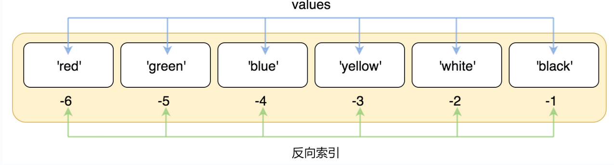
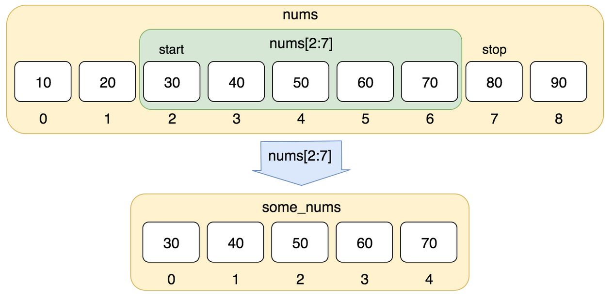

# 第九章: Python3 列表(List)

[[toc]]

> 说在前面的话，本文为个人学习[Python3 教程](https://www.runoob.com/python3/python3-tutorial.html)后进行总结的文章，本文主要用于<b>Python3基础知识</b>。

## 1. 列表（List）

> - 序列是 Python 中最基本的数据结构。
> - 序列中的每个值都有对应的位置值，称之为索引，第一个索引是 0，第二个索引是 1，依此类推。
> -  Python 有 6 个序列的内置类型，但最常见的是**列表**和**元组**。

> - List（列表） 是 Python 中使用最频繁的数据类型。
>
> - 列表可以完成大多数集合类的数据结构实现。
>
> - 列表中元素的类型可以不相同，它支持数字，字符串甚至可以包含列表（所谓嵌套）。
> - 列表是写在方括号 [] 之间、用逗号分隔开的元素列表。
>
> - 列表都可以进行的操作包括索引，切片，加，乘，检查成员。
> - Python 已经内置确定序列的长度以及确定最大和最小的元素的方法。
> - 列表的数据项不需要具有相同的类型

## 2.创建1个列表

> 创建一个列表，只要把逗号分隔的不同的数据项使用方括号括起来即可。

示例如下:

```python
#! /usr/bin/python3

# 创建1个列表

list1=['red', 'green', 'blue', 'yellow', 'white', 'black']
list2=[1,2,3,4,5]

print(list1)
print(list2)
```

执行后结果如下：

```python
['red', 'green', 'blue', 'yellow', 'white', 'black']
[1, 2, 3, 4, 5]
```

## 3. 访问列表中的值

> 与字符串的索引一样，列表索引从 0 开始，第二个索引是 1，依此类推。
>
> 通过索引列表可以进行截取、组合等操作。
>
> 

实例1：

```python
#!/usr/bin/python3

list = ['red', 'green', 'blue', 'yellow', 'white', 'black']
print( list[0] )
print( list[1] )
print( list[2] )
```

之后结果如下：

```python
red
green
blue
```

> 索引也可以从尾部开始，最后一个元素的索引为 -1，往前一位为 -2，以此类推。



实例2：

```python
#!/usr/bin/python3

list = ['red', 'green', 'blue', 'yellow', 'white', 'black']
print( list[-1] )
print( list[-2] )
print( list[-3] )
```

执行后结果如下：

```python
black
white
yellow
```

> 使用下标索引来访问列表中的值，同样你也可以使用方括号 `[]` 的形式截取字符，截取包含开始索引到不包含结束索引区间的元素，如下所示：



实例3：

```python
#!/usr/bin/python3

nums = [10, 20, 30, 40, 50, 60, 70, 80, 90]
print(nums[0:4]
```

执行后结果如下：

```python
[10, 20, 30, 40]
```

> 使用负数索引值截取：

实例4：

```python
#!/usr/bin/python3

list = ['Google', 'Runoob', "Zhihu", "Taobao", "Wiki"]

# 读取第二位
print ("list[1]: ", list[1])
# 从第二位开始（包含）截取到倒数第二位（不包含）
print ("list[1:-2]: ", list[1:-2])
```

执行后的结果如下：

```python
list[1]:  Runoob
list[1:-2]:  ['Runoob', 'Zhihu']
```

## 4. 更新列表list

> 你可以对列表的数据项进行修改或更新，你也可以使用`append()` 方法来添加列表项，如下所示：

```python
#!/usr/bin/python3

list = ['Google', 'Runoob', 1997, 2000]

print ("第三个元素为 : ", list[2])
list[2] = 2001
print ("更新后的第三个元素为 : ", list[2])

list1 = ['Google', 'Runoob', 'Taobao']
list1.append('Baidu')
print ("更新后的列表 : ", list1)
```

执行后结果如下：

```python
第三个元素为 :  1997
更新后的第三个元素为 :  2001
更新后的列表 :  ['Google', 'Runoob', 'Taobao', 'Baidu']
```

::: warning 注意

`append()` 方法的使用，后续会在[Python列表函数&方法]()中进行再叙。

:::

## 5.删除列表list元素

> 可以使用 del 语句来删除列表中的元素，如下实例：

```python
#!/usr/bin/python3
 
list = ['Google', 'Runoob', 1997, 2000]
 
print ("原始列表 : ", list)
del list[2]
print ("删除第三个元素 : ", list)
```

以上实例输出结果：

```python
原始列表 :  ['Google', 'Runoob', 1997, 2000]
删除第三个元素 :  ['Google', 'Runoob', 2000]
```

::: warning 注意

`remove()` 方法的使用，后续会在[Python列表函数&方法]()中进行再叙。

:::

## 6. Python列表脚本操作符

> 列表对 `+` 和  `*` 的操作符与字符串相似。`+` 号用于组合列表，`*` 号用于重复列表。

如下表所示：

| Python 表达式                         | 结果                         | 描述                 |
| ------------------------------------- | ---------------------------- | -------------------- |
| len([1, 2, 3])                        | 3                            | 长度                 |
| [1, 2, 3] + [4, 5, 6]                 | [1, 2, 3, 4, 5, 6]           | 组合                 |
| ['Hi!'] * 4                           | ['Hi!', 'Hi!', 'Hi!', 'Hi!'] | 重复                 |
| 3 in [1, 2, 3]                        | True                         | 元素是否存在于列表中 |
| for x in [1, 2, 3]: print(x, end=" ") | 1 2 3                        | 迭代                 |

## 7.Python 列表截取与拼接

Python 的列表截取与字符串操作类似，如下所示：

```python
 L=['Google', 'Runoob', 'Taobao']
```

操作：

| Python 表达式 | 结果                 | 描述                                                     |
| ------------- | -------------------- | -------------------------------------------------------- |
| L[2]          | 'Taobao'             | 读取第三个元素                                           |
| L[-2]         | 'Runoob'             | 从右侧开始读取倒数第二个元素: <br />count from the right |
| L[1:]         | ['Runoob', 'Taobao'] | 输出从第二个元素开始后的所有元素                         |

实例如下：

```python
#!/usr/bin/python3

L = ['Google', 'Runoob', 'Taobao']

# 读取第三个元素
print("读取第三个元素: ",L[2])

# 读取list
print("读取list: ",L)

# 从右侧开始读取倒数第二个元素
print("从右侧开始读取倒数第二个元素: ", L[-2])

# 输出从第二个元素开始后的所有元素
print("输出从第二个元素开始后的所有元素: ", L[1:])
```

执行后结果如下：

```python
读取第三个元素:  Taobao
读取list:  ['Google', 'Runoob', 'Taobao']
从右侧开始读取倒数第二个元素:  Runoob
输出从第二个元素开始后的所有元素:  ['Runoob', 'Taobao']
```

> 列表还支持拼接操作：

```python
#!/usr/bin/python3

# 列表还支持拼接操作

squares = [1,4,9,16, 25]

squares += [36, 49,64, 81, 100]

print(squares)
```

执行后结果如下：

```python
[1, 4, 9, 16, 25, 36, 49, 64, 81, 100]
```

## 8.嵌套列表

> 使用嵌套列表即在列表里创建其它列表

实例:

```python
#!/usr/bin/python3

# 嵌套列表


a=['a','b','c']

b=[1,2,3]

c=[a,b]

print(c)
```

执行后结果如下：

```python
[['a', 'b', 'c'], [1, 2, 3]]
c[0] =  ['a', 'b', 'c']
c[1] =  [1, 2, 3]
```

## 9.列表比较

> <b>列表比较</b> 需要引入 `operator `模块的 `eq `方法：

实例：

```python
#!/usr/bin/python3

# 列表比较

# 导入 operator 模块

import operator

a = [1,2]

b = [3,4]

c = [3,4]

print("operator.eq(a,b)", operator.eq(a,b))
print("operator.eq(c,b)", operator.eq(c,b))
```

执行后结果如下：

```python
operator.eq(a,b) False
operator.eq(c,b) True
```

## 10.Python的列表的函数和方法

Python包含以下函数:

| 序号 | 函数                           |
| ---- | ------------------------------ |
| 1    | `len(list)` 列表元素个数       |
| 2    | `max(list)`返回列表元素最大值  |
| 3    | `min(list)` 返回列表元素最小值 |
| 4    | `list(seq)`将元组转换为列表    |

Python包含以下方法:

| 序号 | 方法                                                         |
| ---- | ------------------------------------------------------------ |
| 1    | `list.append(obj)`  <br />在列表末尾添加新的对象             |
| 2    | `list.count(element)` <br />统计某个元素在列表中出现的次数   |
| 3    | `list.extend(seq)` <br />在列表末尾一次性追加另一个序列中的多个值（用新列表扩展原来的列表） |
| 4    | `list.index(obj)` <br />从列表中找出某个值第一个匹配项的索引位置 |
| 5    | `list.insert(obj)`<br />将对象插入列表                       |
| 6    | [list.pop([index=-1\])](https://www.runoob.com/python3/python3-att-list-pop.html) 移除列表中的一个元素（默认最后一个元素），并且返回该元素的值 |
| 7    | [list.remove(obj)](https://www.runoob.com/python3/python3-att-list-remove.html) 移除列表中某个值的第一个匹配项 |
| 8    | [list.reverse()](https://www.runoob.com/python3/python3-att-list-reverse.html) 反向列表中元素 |
| 9    | [	list.sort( key=None, reverse=False)](https://www.runoob.com/python3/python3-att-list-sort.html) 对原列表进行排序 |
| 10   | [list.clear()](https://www.runoob.com/python3/python3-att-list-clear.html) 清空列表 |
| 11   | [list.copy()](https://www.runoob.com/python3/python3-att-list-copy.html) 复制列表 |
