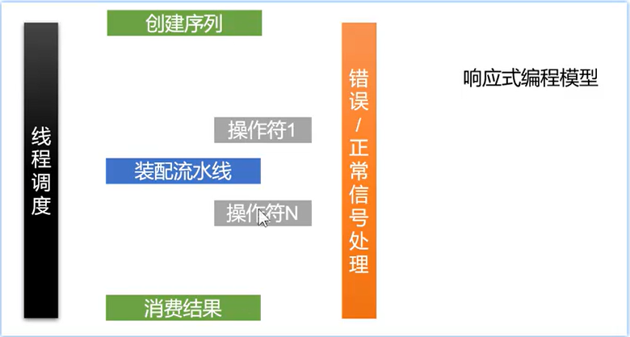

# 第四章: Reactor 框架

[[toc]]

> 说在前面的话，本文为个人学习[SpringBoot3响应式编程精讲](https://www.bilibili.com/video/BV1gsYEeLEuM?spm_id_from=333.788.videopod.episodes&vd_source=65c7f6924d2d8ba5fa0d4c448818e08a)后进行总结的文章，本文主要用于<b>响应式编程</b>。

## 【1】本章学习图解


## 【2】Project Reactor 官网

> 英文官网地址:  [https://projectreactor.io/](https://projectreactor.io/)

> 以往：

::: tabs

@tab:active  **高并发三宝**

- **异步**
- **缓存**
- **队列排好**

@tab **高可用三宝**

- **分片**
- **复制**
- **选领导**

@tab **非阻塞的原理**

- **缓冲区**
- **回调**

:::

> 现在，1个框架就全搞定了。 这就是 `Project Reactor` 框架

## 【3】Reactor 响应式编程模型




## 【4】引入相关jar

::: tabs

@tab:active 引入父pom的jar

``` xml
  <!--    引入project reactor 的jar     -->
<dependencyManagement> 
    <dependencies>
        <dependency>
            <groupId>io.projectreactor</groupId>
            <artifactId>reactor-bom</artifactId>
            <version>2024.0.6</version>
            <type>pom</type>
            <scope>import</scope>
        </dependency>
    </dependencies>
</dependencyManagement>
```

@tab 再在子pom.xml中引入使用的jar

```xml
<dependencies>
    <dependency>
        <groupId>io.projectreactor</groupId>
        <artifactId>reactor-core</artifactId> 
        
    </dependency>
    <dependency>
        <groupId>io.projectreactor</groupId>
        <artifactId>reactor-test</artifactId> 
        <scope>test</scope>
    </dependency>
</dependencies>
```

:::

## 【5】核心组件 Mono 和 Flux 

> 万物皆数据，数据分2种，1种是**单个或者没有**，另一种是**多个**
>
> 数据流 = N个元素  + 1个信号(完成/异常)


> 


## 【X】参考资料

- [SpringBoot3响应式编程精讲](https://www.bilibili.com/video/BV1gsYEeLEuM?spm_id_from=333.788.videopod.episodes&vd_source=65c7f6924d2d8ba5fa0d4c448818e08a)